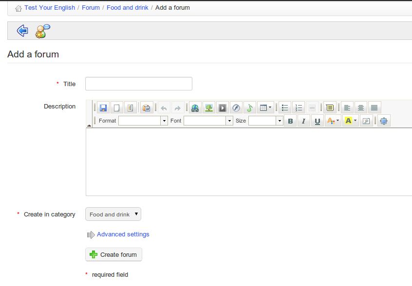

# Forum hinzufügen

Von der _Forum_ Seite:

* Klicken Sie auf _Neues Forum_,
* gib ihm einen Namen,
* ggf. eine Beschreibung hinzufügen,
* In den erweiterten Einstellungen ist es möglich:
  * Ermächtigen Sie die Lernenden, ihre eigenen Antworten zu ändern,
  * Ermächtigen Sie die Lernenden, neue Diskussionsfäden zu erstellen,
  * Legen Sie die Standardansicht fest,
  * entscheiden, ob das Forum das einer Gruppe ist, ob es öffentlich oder privat ist,
* Klicken Sie auf die Schaltfläche _Create forum_.

\_Illustration 70: Forum — Formular zur Erstellung von Foren

