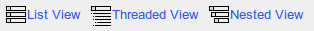

# Verwenden von Forenansichten

Abhängig von der Komplexität des Austauschs in den Foren können verschiedene Anzeigemodi verwendet werden, um das Lesen und Beantworten von Diskussionsthemen zu vereinfachen.

* **Listenansicht**: zeigt einfach Nachrichten in chronologischer Reihenfolge an,
* **Threaded-Ansicht**: zeigt jeweils nur einen Antwortthread an,
* **verschachtelte Ansicht**: verwendet die Thread-Ansicht, zeigt jedoch ein vollständiges Thema an.

\_Illustration 68: Forum — Anzeigemodi

