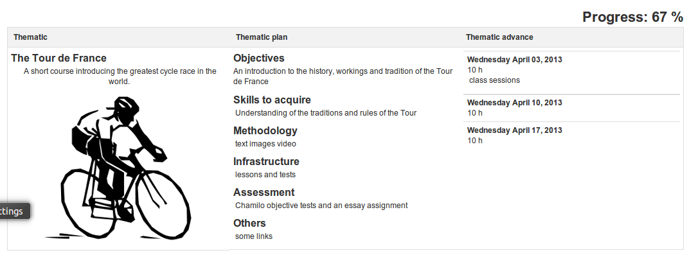
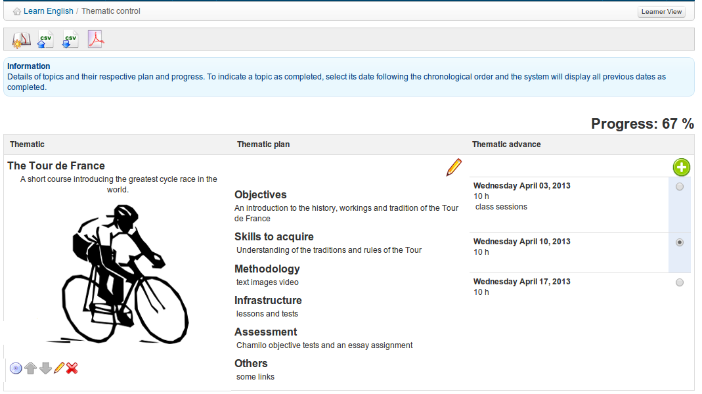

# Kursfortschritt

Das Tool _Course Progress_  \(oder vielleicht _Course Diary_ - der Name dieses Tools wird noch in Betracht gezogen\) ermöglicht es dem Lehrer, ein Kursprogramm zu erstellen, das \(optional\) auf der Kursseite angezeigt wird, um einen Fortschrittsstatus im Vergleich zu den aktuellen Lehrern und Lernenden aufzunehmen geplante Themenvorbereitung

_Illustration 135: Kursfortschritt — Ansicht der Lernen_

Dieses Tool ist nur bei “synchronous” -Kursen nützlich, bei denen der Lehrer und die Lernenden gleichzeitig den Kurs durchlaufen. Die Konfiguration von _Course Progress_ ist ziemlich einfach, obwohl dies ein ziemlich langwieriger Prozess ist.

\_Illustration 136: Kursfortschritt — Lehrer-Ansicht

