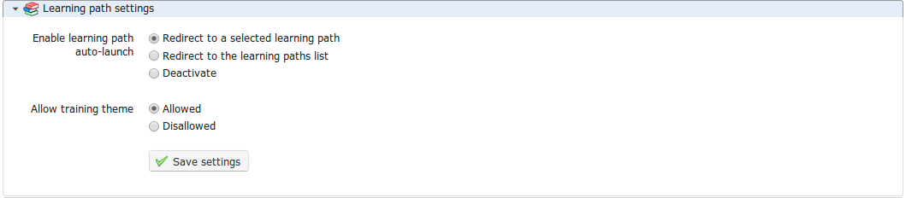

# Einstellungen für den Lernpfad

Der Abschnitt _Learning path_  kann verwendet werden, um das _auto-launch_ von Lernpfaden und den Stil \(oder das grafische Thema\) für den Kurs zu aktivieren.

_Illustration 177: Kurseinstellungen — Einstellungen für den Lernpfad_

Die automatische Startfunktion ermöglicht es dem Lehrer, einen bestimmten Lernpfad zum automatischen Start auszuwählen, wenn der Benutzer die Kurs-Homepage betritt. Um diese Funktion nutzen zu können, müssen Sie die Option in den Kurseinstellungen aktivieren \(denken Sie daran, die Änderungen zu speichern\), dann zur Liste der Lernpfade gehen und auf das Raketensymbol klicken, das den automatischen Start eines der Lernpfade darstellt:

_Illustration 178: Lernpfade - Auto-launch_

Es kann jeweils nur ein Lernpfad als automatischer Start festgelegt werden, und er beginnt, sobald der Teilnehmer die Kurs-Homepage betritt. Andere Lernpfade zeigen ein graues Raketensymbol. Um diese Option zu testen, müssen Sie sich als Lernender verbinden, da sie aus praktischen Gründen für Lehrer deaktiviert wurde.

Solange der Plattformadministrator diese Funktion aktiviert hat, kann der Lehrer die Option _Schulungsthema erlauben_ auswählen, um den grafischen Stil seines Kurses auszuwählen. Es ist auch möglich, ein separates Thema für einen individuellen Lernpfad auszuwählen. Dies bedeutet, dass ein Lernender theoretisch auf seinen Chamilo-Campus eintreten, die Plattform in einem bestimmten visuellen Stil sehen könnte, \(z. B. hauptsächlich blau\), einen Kurs betreten und sehen kann, wie sich der Stil in Rot ändert, dann einen Lernpfad betreten und den Stil meist grün sehen... Aus Gründen des visuellen Komforts wird jedoch empfohlen, Stiländerungen zu vermeiden, es sei denn, sie sind aus echten pädagogischen Gründen gerechtfertigt.

Hinweis: Ein Teilnehmer kann über das linke Menü innerhalb des Lernpfads zur Kurs-Homepage zurückkehren. Die Idee hier besteht nicht darin, die Kurs-Homepage zu deaktivieren oder zu verbergen, sondern den Zugriff auf die Kursinhalte zu beschleunigen.

