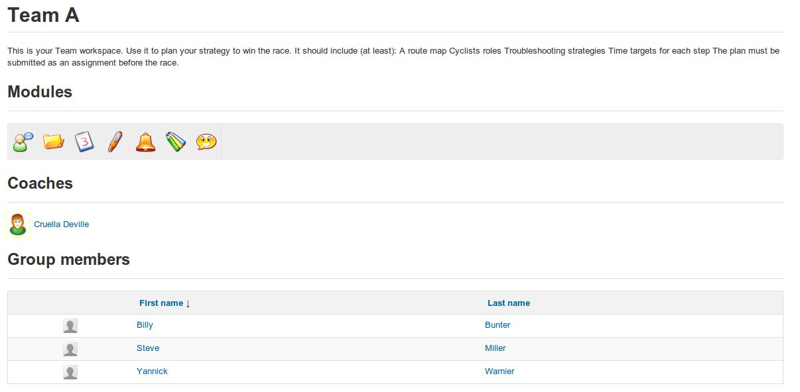

# Einstieg in einen Gruppenbereich

Gruppenmitglieder können auf den “workspace” der Gruppe zugreifen, indem sie einfach auf den Namen der entsprechenden Gruppe in der Auflistung auf der Hauptseite von _Groups_ klicken. Auf der Seite werden die Gruppenbeschreibung \(z. B. eine Liste von Zielen und Zielen\) und Details der Mitgliedschaft sowie die eigenen “toolbar” der Links zu den verschiedenen Tools der Gruppe \(_Foren, Dokumente, Agenda, Aufgaben, Ankündigungen, Wiki_ und \_chat\) angezeigt, die auf die verschiedenen \(privaten\) Gruppenarbeitsbereiche verlinken:

_Illustration 152: Gruppen — Gruppenraum_

Im Gruppenbereich können Sie das Informationsblatt eines Teilnehmers abfragen, indem Sie einfach auf ihren Namen in der Liste der Mitglieder im unteren Teil der Seite klicken.

