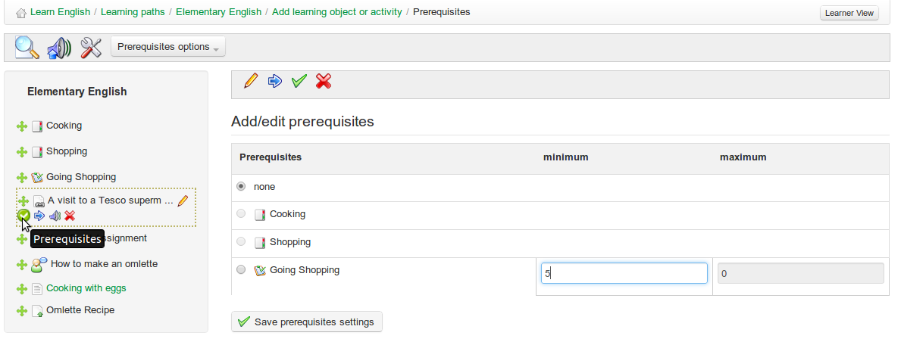

# Voraussetzungen

Wenn ein Lernpfad mehrere Elemente enthält, ist es möglich, den Abschluss von Aufgaben und Zielen festzulegen, die von Lernenden erwartet werden, die dem Lernpfad folgen, mit der Funktion _prerequisites_.

Klicken Sie auf die Schaltfläche _prerequisites_  neben einem beliebigen Element im Pfad \(oder  in der Bearbeitungsansicht\):

_Illustration 85: Lernpfade - Voraussetzungen_

Dies ermöglicht es dem Lehrer zu verlangen, dass der Lernende eine andere Aufgabe im Lernpfad erledigt hat \(z. B. die vorhergehende Aufgabe\), bevor er auf dieses Element zugreifen kann, und auch, z. B. im Falle eines Tests oder einer Bewertung, eine bestimmte Mindestpunktzahl erreicht hat.

Mit der Schaltfläche _prerequisite optionen_ in der Symbolleiste können Voraussetzungen für das Abschließen des vorhergehenden Schritts global für alle Schritte im Pfad festgelegt werden, oder alternativ können alle Voraussetzungen aus dem Pfad gelöscht werden.

_Illustration 86: Lernpfade — Optionen für Voraussetzungen_

