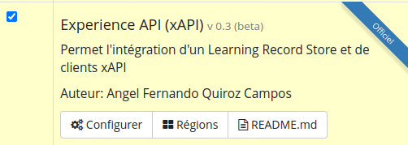
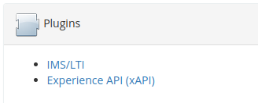

# Plugin xapi

El soporte de xapi fue incluido en Chamilo desde la version 1.11.16 como un plugin y sera incluido en el core mas adelante.

Alactivar el plugin se activa varias funcionalidades en Chamilo

## Conexion a un LRS Externo

La activación del plugin permite primero enviar xapi statement a un LRS externo al realizar actividades en Chamilo.
Entonces primero se tiene que activar el plugin.

En la configuración se indica lo datos del LRS externo y se indica las actividades que se querie seguir desde Chamilo.

Lo que se hace en Chamilo cuando hay un evento que tiene que generar un api statement se esta guardando en la tabla "xapi_shared_statement" para que no demore en registrarse, ya que el envio a un LRS podria tomar tiempo entonces este envio al LRS se hace de manera asyncrona con un cron que llama plugin/xapi/cron/send_statements.php cada hora por ejemplo. Este script manda 100 statements cada vez que esta llamado entonces se tiene que adaptar la frecuencia del cron dependiendo del uso de su plataforma.

Desde este momento se puede enviara las statements de los eventos seleccionados al LRS externo.

## Chamilo como LRS

Chamilo puede ser el LRS que almazene los datos que sean de Chamilo o de otros aplicativos externos.
Por esto en la pagina de administración de Chamilo un bloque Plugins aparece con un link para "Experience API (xAPI).

En esta pagina de da click en el + para crear una nueva cuenta para connectarse al LRS de su Chamilo.

Desde este momento el LRS de su Chamilo esta disponible y se puede usar con su Chamilo o con cualquier herramienta compatible con xAPI indicando los datos del usuario que acaban de crear y la URL de su Chamilo con al final /plugin/xapi/lrs.php

## Importacion de paquete xAPI

Al activar el plugin xAPI se agrega una herramienta actividad en cada curso de Chamilo.
En esta herramienta se puede importar paquete de contenido compatible xAPI.

Estas actividad se pueden lanzar desde esta herramienta o pueden ser incluidas como un item de una leccion de Chamilo.

En la herramienta de actividades el profesor puede ver lo que se ha registrado de la actividad xAPI.

