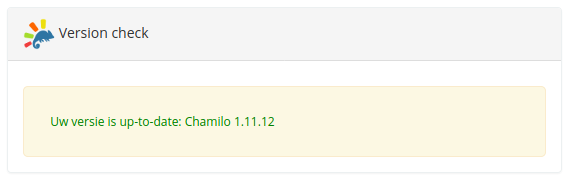
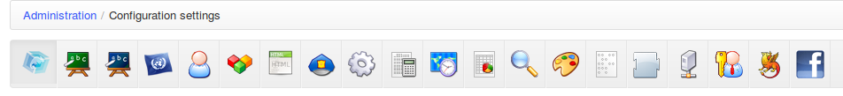
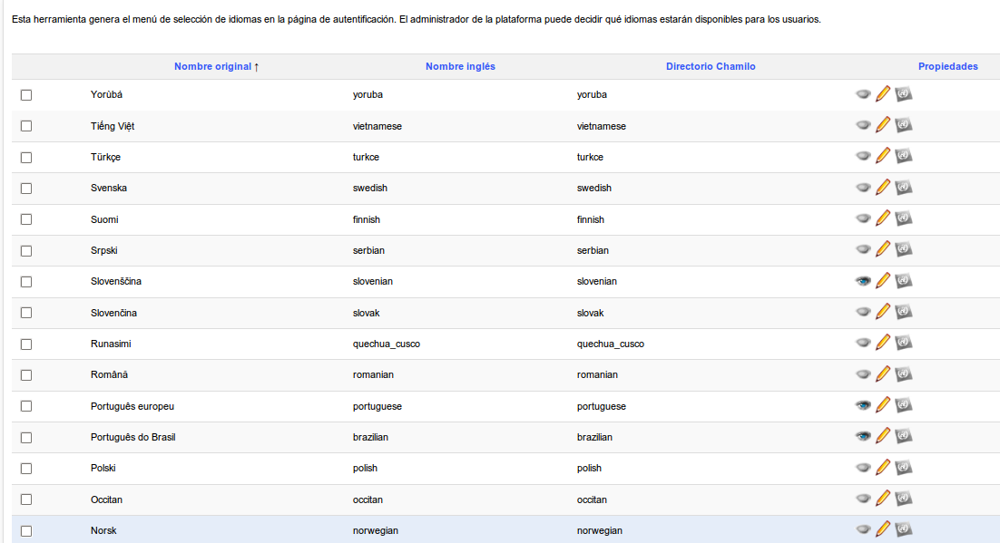
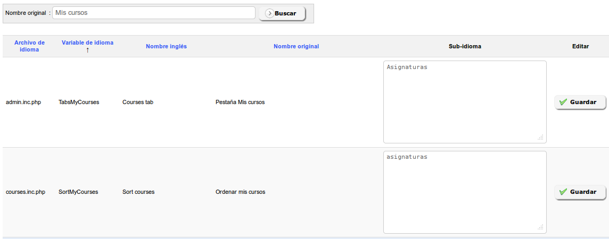
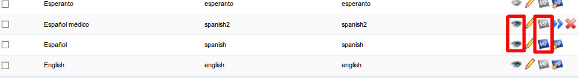

# Administrar la plataforma

 Ilustración 30: Administración - Bloque plataforma

La configuración de la plataforma se realiza a través de la pestaña _Administración_, bloque plataforma.

## Opciones de configuración de Chamilo 

Estos ajustes se unen a varias secciones como se observa en la siguiente ilustración.

 _Ilustración 31: Administración - Secciones de las opciones de configuración_

Chamilo ofrece una configuración predeterminada que puede ser diferente a la que usted necesite. Sólo vamos a ver aquí las opciones más importantes o con más probabilidad de que sean cambiadas. De todas formas, piense que un administrador debe conocer perfectamente su entorno, así que siempre podrá encontrar una lista completa de ajustes en el Apéndice de la página 99.

### Portal 

Esta sección permite configurar la información visible, el registro de usuarios, y otras opciones generales de carácter general. En algunos elementos la información que pueden contener se puede dejar vacía, en cuyo caso no se mostrará nada.

**Registro** permite autorizar la creación de cuentas por parte de usuarios externos o que sólo el administrador pueda crearlas o que habiéndola creado un usuario externo se requiera la aprobación del administrador para su funcionamiento.

**Registro como docente,** permite que cualquier nuevo usuario pueda registrarse como docente y por lo tanto poder crear cursos. Normalmente no necesitará activar esta opción.

**Habilitar la vista estudiante,** permite a los docentes tener una vista previa de como su curso sería visto por un alumno. Es una herramienta muy útil y no se recomienda que elimine esta característica.

**Página después de identificarse,** permite seleccionar si desea que el usuario pueda volver a la página bienvenida de la plataforma \(Página principal\) o ir directamente a su lista de cursos \(Mis cursos\).

**Permitir que el administrador pueda crear cursos,** posibilita la creación de cursos por parte del profesorado. Por defecto la creación de cursos por el profesorado está permitida, pero en una organización fuertemente estructurada puede que sea mejor desactivar esta opción y reservar esta tarea al administrador de la plataforma, quien configurará cursos y asignará docentes de acuerdo con la estructura y necesidades de la organización.

**Los estudiantes pueden consultar el catálogo de cursos,**posibilita que el catálogo de cursos de muestre a los alumnos, disponible como un enlace en su página de lista de cursos. El catálogo de cursos ofrece enlaces a la suscripción, por lo que si esta opción está desactivada tampoco podrán registrarse por sí mismos.

**Habilitar términos y condiciones,**en el formulario de registro muestra a los nuevos usuarios los _términos y condiciones,_ que usted haya configurado en la página de administración. Los términos y las condiciones trabajan con diferentes idiomas y versiones, por lo que podrá asegurarse de que sus alumnos tendrán acceso al portal sólo si están de acuerdo con la última versión de los mismos.

### Cursos 

En esta sección se configuran las opciones relacionadas con los cursos, sus usuarios, creadores y otros detalles de carácter técnico. Compruebe cuidadosamente cada opción hasta satisfacer sus necesidades.

Algunas de las opciones tienen repercusiones en la usabilidad de la plataforma, en la forma de mostrar la página principal o en la barra de acceso directo a las herramientas de los cursos.

**Espacio por defecto en el disco duro,** es el espacio permitido en el disco del servidor para los archivos de la herramienta documentos de un curso en concreto. Por defecto, se establece en 100,000,000 bytes, lo que representa alrededor de 95MB. Puede cambiar esta opción en cada curso, accediendo a ellos mediante la lista de cursos de la página de administración. Sólo un administrador podrá realizar estos cambios.

**Permitir a los tutores la edición en los cursos de las sesiones,** hará posible que los docentes editen el contenido de los cursos dentro del contexto de una sesión \(modificar documentos, lecciones, ejercicios, enlaces, etc.\). Ver el capítulo Capítulo 6 Administración de sesiones de la página 69.

### Sesiones 

En esta sección se encuentran todas las opciones relacionadas con las sesiones. Las sesiones son explicadas a continuación, y representan un mecanismo potente pero complejo para gestionar cursos en el tiempo.

### Idiomas 

En esta sección se encuentran todas las opciones relacionadas con los idiomas. Un enlace apunta a la entrada de _Idiomas_ de la página de administración.

**Permite definir sub-idiomas**hace posible la definición de las variaciones de cada término del idioma utilizado en la interfaz de la plataforma, como un idioma basado en un idioma existente. Esta opción puede ser encontrado en la lista de idiomas\(siga el enlace [_Idiomas de la plataforma Chamilo_](http://chamilo.beeznest.com/main/admin/languages.php)\) .

### Usuarios 

Esta sección presenta las opciones relativas a las propiedades de los usuarios y permisos.

**Perfil** define qué partes de su perfil podrán modificar los usuarios. Por defecto, los usuarios no podrán modificar su e-mail.

**Agenda Personal** permite decidir si un usuario puede registrar eventos en su calendario personal.

### Módulos 

Esta sección define las propiedades de los cursos y de las principales herramientas. Tendrá consecuencias en todos los cursos.

**Módulos activos al crear un curso,**establece las herramientas que serán visibles por defecto al crear un curso. Los docentes pueden modificar esta configuración según sus necesidades.

**Los archivos eliminados no pueden ser recuperados**, permite crear una copia de seguridad de cada archivo que sea borrado por un usuario, aunque ésta no será visible a través del sistema. La copia de cada archivo tendrá el sufijo `__DELETED__` y permitirá al administrador de la plataforma recuperar manualmente estos archivos en caso de que hubieran sido borrados accidentalmente.

**Editor de correo electrónico en línea,** permite decidir si desea proporcionar a sus usuarios una manera de enviar e-mails a otros usuarios de la plataforma sin necesidad de un cliente externo de correo electrónico. Actívelo haciendo clic en el enlace de contacto administrativo en el pie de portal.

### Editor HTML 

Esta sección contiene todos los ajustes relacionados con lo que se puede hacer a través del editor en línea. Esto incluye la creación de expresiones matemáticas y otras extensiones.

**Gestor avanzado de ficheros para el editor WYSIWYG,** permite elegir entre un simple y fácil gestor de archivos y otro más avanzado y algo más complicado. Para ver el resultado, despliegue el editor en cualquier lugar de un curso, seleccione el icono insertar imagen y finalmente haga clic en _navegar por el servidor_.

**Nota**: WYSIWYG es una abreviatura de “Lo que ves es lo que obtienes”, otra manera de decir que el editor le permite editar las cosas visualmente en la pantalla mientras se guarda en un formato más complejo sin tener que preocuparse por ello.

**Editores Matemáticos:** **MimeTeX**, **ASCIImathML**y preinstalación de **WIRIS**. Estas tres opciones le permiten activar tres formas de edición de formulas matemáticas. También se incorpora un editor de gráficos matemáticos **ASCIIsvg**. El funcionamiento de todos ellos puede variar dependiendo de los navegadores de los usuarios. Varios editores pueden estar activados a un tiempo.

### Seguridad 

Esta sección le permite configurar algunos elementos relacionados con la seguridad de su plataforma. Las opciones por defecto son suficientes, pero es posible que desee restringir algunas cosas para aumentar su nivel de seguridad.

**Tipo de filtrado en el envío de documentos,** establece dos tipos de filtrado:

* Blacklist es una manera de evitar archivos con una extensión específica. Por ejemplo, permite decidir que los archivos ejecutables \(.exe, ...\) no puedan ser subidos a la plataforma. Este método de filtrado es considerado el más débil.
* Whitelist es una manera de decir “Sólo deseo permitir que se suban archivos que coincidan con mis extensiones autorizadas”. Que se usen mayúsculas o minúsculas no importa. Es un método de filtrado más seguro pero algo más limitado.

**Permisos para los nuevos directorios,** establece los permisos que tendrán los directorios de nueva creación. Es una opción que en sistemas basados en Linux permitirá aumentar la seguridad del sistema frente a personas no deseadas.

_**Warning**:_ el valor por defecto es " 0777 ", por garantizar una mayor portabilidad y porque permisos más restrictivos pueden causar algún problema. Si su sistema Linux requiere una estricta política de seguridad podrá modificarlo. Una vez modificado, puede que reciba un error del servidor cada vez que intente entrar en los nuevos cursos que cree a partir de ahora. En este caso, cambie este valor y cree otro curso hasta que no se produzca este error. Los valores con los que puede probar son: 0750, 0755, 0775 y 0777. Finalmente borre los cursos que presentan el error.

**Registro de usuarios por el tutor,**permite a los tutores \(los docentes en las sesiones\) registrar nuevos usuarios en la plataforma.

### Rendimiento 

Esta sección permite mejorar la eficiencia de la plataforma.

**Dividir el directorio de transferencias \(upload\) de los usuarios,** mejora la velocidad en las plataformas con una carga muy alta, mediante la división del directorio personal de los usuarios. No obstante, esto también requiere una operación manual en el disco.

Desde la versión 1.8.8.4 \(año 2011\), también se pueden encontrar consejos de optimización en _chamilo/documentation/optimization.html_.

### Evaluaciones 

Estos son los parámetros globales de la herramienta de evaluación que, en la mayoría de los casos, pueden ser redefinidos dentro de cada curso de forma específica.

**Coloreado de puntuación,** permite la coloración a partir de las marcas que se establezcan en las evaluaciones. También es necesario definir las marcas que se colorearán en rojo.

**Marcas de etiquetado de niveles,** permite establecer niveles diferentes de marcas como etiquetas \(“E” nivel de menos del 50%\).

### Zonas Horarias 

Esta sección define las opciones generales de las zonas horarias.

**Zonas horarias de los usuarios,** permitirá a los usuarios definir sus propias zonas horarias y disponer de ellas en todo momento en la pantalla de la plataforma. Esto, por ejemplo, les permitirá conocer con mayor precisión el momento en que presentan un trabajo. Tenga en cuenta que este ajuste tiene que realizarse junto con la activación de la posibilidad de modificación del campo de _zona horaria_ por el usuario en los _campos de perfil de usuario_ \(ver el capítulo 4.10Gestionar los campos de usuarios de la página 62\).

**Valor de la zona horaria,**se utiliza para definir la zona horaria del portal. Esto permite obtener los valores de tiempo adecuados a la ubicación del usuario cuando el servidor se encuentra alojado y configurado en una zona horaria diferente.

### Informes 

Esta sección le permite configurar mecanismos de SEO y de analíticas de su portal Chamilo, dándole acceso a las cabeceras del portal.

### Buscar 

Esta sección permite configurar la característica de indexación de texto completo de Chamilo. Requiere el módulo php5-xapian y otras aplicaciones adicionales en el servidor. Esta característica sólo estaba disponible en la versión medical, pero se incorporó a la versión principal de Chamilo 1.8.8.4 como compromiso de los proveedores oficiales Chamilo.

No dude en solicitar alojamiento dedicado de uno de los proveedores oficiales de Chamilo si tiene alguna dificultad en la configuración.

### Hojas de estilo 

Las hojas de estilo permiten definir el estilo visual global de su plataforma.

 _Ilustración 32: Administración - Configuración de las hojas de estilo_

Desde la versión 1.8.7, es posible que usted pueda crear sus propias hojas de estilo y enviarlas al servidor. Puede recuperar una copia de uno de los estilos existentes en _chamilo/app/Resources/public/css/themes/_ y cambiar el nombre del directorio de recuperación \(en su ordenador, no en el servidor\). A partir de aquí, puede modificar el estilo a su gusto y enviar el directorio que contiene su trabajo en un archivo zip con el nombre que desee. Tras realizar esto, seleccione el estilo que ha creado en la lista desplegable y si está contento con el resultado, haga clic en el botón _Guardar configuración_ para aplicar este estilo a todo su portal.

### Plantillas 

Las plantillas de documentos permiten acelerar la creación de contenidos en Chamilo. La creación de nuevas plantillas desde este zona de la plataforma afectará a todos los cursos del portal.

Crear, editar y eliminar plantillas es muy fácil. En cada curso podrá usar estas plantillas cuando cree o edite un documento del curso. No dude en probar esta funcionalidad, creando algunas plantillas de prueba que siempre podrá borrar si no son de su agrado.

Esta característica es particularmente útil para establecer sus propias plantillas según las normas de su organización.

### Plugins 

Esta sección permite habilitar los plugins disponibles en la carpeta _plugin/_ del servidor.

 _Ilustración 33: Administración - Instalación de plugins_

Desde la versión 1.8.8.2 de Chamilo al habilitar un plugin éste puede aparecer como una herramienta más en el curso, tal y como ocurre con el plugin _BigBlueButton_. Si activa este plugin podrá conectar su portal Chamilo a un servidor de vídeo-conferencia. Chamilo no incorpora el servidor de vídeo-conferencia, por lo que tendrá que instalarlo usted mismo o pedir ayuda a un proveedor oficial.

> **Nota**: Hemos seleccionado un servidor de vídeo-conferencia muy fácil de instalar, apenas 30 minutos en un servidor rápido y apropiado. Sin embargo, un servidor de vídeo-conferencia puede causar problemas a otro nivel ya que requiere un cuidado constante para estar disponible en todo momento, debiendo ser supervisado por personal especializado. Esta es una de las razones por las que no se incluye en Chamilo: no acompañaría a la calidad de Chamilo como plataforma independiente.

### LDAP 

Esta sección le permite configurar la sincronización con un servidor LDAP. Contiene una larga serie de ajustes que requieren de un buen conocimiento de LDAP, por lo que le invitamos a ampliar su información mediante documentación específica sobre LDAP. Tenga en cuenta que un servidor ActiveDirectory puede ser utilizado como un servidor LDAP a través del modo LDAP -compatibility.

### CAS 

Esta sección le permite configurar la conexión con servidores de autenticación CAS. No obstante, puede ser necesario modificar algunos archivos para que funcione, ya que los servidores CAS pueden tener configuraciones específicas. Por favor leer con atención.

### Shibboleth 

Esta sección le permite configurar la conexión con servidores de autenticación Shibboleth. No obstante, puede ser necesario modificar algunos archivos para que funcione, ya que los servidores Shibboleth pueden tener configuraciones específicas. Por favor leer con atención.

### Facebook 

Esta sección le permite configurar la conexión con servidores de autenticación Facebook. No obstante, puede ser necesario modificar algunos archivos para que funcione, ya que los servidores Facebook pueden tener configuraciones específicas. Por favor leer con atención.

### Crons 

Esta sección le permite configurar parámetros de procesos \(cronológicos\) que tienen que lanzarse en momentos determinados. Esto requiere de la configuración de archivos en el sistema operativo del servidor Chamilo. A leer con atención.

## Idiomas 

Aquí podrá definir los idiomas que estarán disponibles para los usuarios cuando se éstos se registren o creen un curso.

 Ilustración 34: Administración - Administración de idiomas

Si activa la funcionalidad de sub-idiomas, podrá redefinir algunos términos en el interfaz del portal. Para ello, active esta opción en la página de configuración de idiomas \(ver la sección 3.1.4Idiomas\), a continuación abra la página de lista de idiomas. Aquí encontrará un icono adicional que le permite agregar un idioma secundario a cualquier idioma existente.

 Ilustración 35: Administración - Icono de creación de sub-idioma

La definición de un sub-idioma es muy fácil: sólo tiene que indicar el nombre del idioma secundario, el código ISO \(2 letras, como “fr”, “en”, “es”\) y su nombre en inglés, no debiendo coincidir este último con alguno ya existente.

Supongamos que usted desea volver a definir los términos de la interfaz, ya que trabaja en el sector médico y los términos en inglés propuestos no son satisfactorios. Por ejemplo, podrá cambiar el término “informes” por el de “evaluación”.

Si piensa definir un sub-idioma es preferible que lo haga antes de crear los cursos del portal.

### Crear un sub-idioma 

Haga clic en el icono de la creación de sub-idioma en el extremo derecho de la línea del idioma seleccionado, por ejemplo el inglés. Rellene el formulario indicando el nombre común de la lengua, por ejemplo "Inglés Médico". Facilite para el mismo un nombre en inglés sin espacios ni acentos, por ejemplo "medical\_english". Proporcione un código ISO igual que el del idioma padre, en este caso “en”.

 _Ilustración 36: Administración - Crear sub-idioma_

Seleccione la _Visibilidad_ para que luego podamos seleccionar su activación, y haga clic en el botón _crear sub-idioma_. Un mensaje de confirmación le sugerirá regresas a la lista de idiomas. Siga el enlace...

 _Ilustración 37: Administración - Lista de idiomas con sub-idiomas_

La página de resultados mostrará una línea un poco diferente al resto, que corresponderá al sub-idioma creado. En el mismo, haga clic en el icono de flecha doble para definir sus propios términos.

### Defina sus propios términos 

La página que se presenta es una página de búsqueda. Si desea modificar un _término_ escriba el texto en la caja de búsqueda para ver todas las veces en que es usado en la plataforma.

 _Ilustración 38: Administración - Redefinición de términos en el sub-idioma_

Una vez que la búsqueda ha generado resultados, modifique cualquiera de los términos o palabras de la columna _nombre original_, con una nueva traducción que introducirá en la columna _sub-idioma_. Finalmente haga clic en el botón _Guardar_. Tenga en cuenta que algunos de los términos aparecen frecuentemente en la traducción de la interfaz, por lo que esta tarea podría tardar un tiempo ...

### Asignar el nuevo sub-idioma 

Tras haber modificado algún término de su sub-idioma. el único paso que queda es asignarlo por defecto a todos los nuevos cursos y usuarios. Para ello, volver a la lista de idiomas y desactivar todos los demás idiomas.

 _Ilustración 39: Administración - Visibilidad y uso por defecto_

En el sub-idioma en cuestión, haga clic en el tercer icono para que se convierta en el idioma por defecto de la plataforma. Eso es todo, la plataforma está personalizada para la actividad en que va a ser usada.

> **Nota**: Esta función avanzada responde a una doble demanda de nuestros usuarios y clientes:
>
> * permitir la edición desde la interfaz web de las palabras o términos del interfaz.
> * permitir volver a utilizar estas palabras o términos después de una actualización de la plataforma sin afectar a los paquetes de idioma por defecto.

## Plugins 

Ver punto 3.1.16, _Plugins_ en página 37. Este enlace es un atajo hacia la misma página.

## Regiones 

Las regiones no representan una funcionalidad directamente útil para un administrador que no sea desarrollador también. Recomendamos no modificar esta sección.

## Anuncios de la plataforma 

Le permite agregar un anuncio global en la página principal del portal y en la parte superior de la lista de cursos.

 _Ilustración 40: Administración - Anuncios globales_

Es posible configurar el tiempo que se mantendrá visible el anuncio, el grupo de personas con determinado rol de docente, alumno o invitado que lo verán y si también se les va a enviar por correo electrónico.

Por ejemplo, puede ser particularmente útil para comunicar actividades de mantenimiento, actualización o cambio de los términos y condiciones en el portal.

## Agenda global 

En esta sección podrá configurar eventos globales que aparezcan en el calendario de **todos** los usuarios del sistema.

La funcionalidad es totalmente similar a la que se puede encontrar en el espacio de los cursos, pero la adición de un evento que tiene un alcance global, todos lo verán a través de su propio calendario.

## Configuración de la página principal 

Desde esta página, usted puede configurar muchas cosas:

1. Editar la pagina principal
2. Editar las categorías de los cursos
3. Editar el bloque aviso
4. Insertar enlaces

 _Ilustración 41: Administración - Configuración de la página principal_

Tenga en cuenta que esta funcionalidad depende del idioma seleccionado. Si se define una página de bienvenida en francés, sólo será visible cuando el francés sea el idioma seleccionado. Esto le permite configurar diferentes mensajes de bienvenida en función de sus usuarios.

## Configuración de la página de registro 

Esta característica le permite añadir una introducción multimedia en la parte superior de la página de registro. Por ejemplo, puede agregar un vídeo que explique cómo registrarse y cuáles son los términos y condiciones del portal. Los campos del formulario se pueden configurar a través de los parámetros de los usuarios en los ajustes de configuración de la plataforma.

## Estadísticas 

Esta herramienta le permite generar pequeños cuadros estadísticos para cuatro categorías de datos:

* Cursos
* Usuarios
* Sistema
* Social

 _Ilustración 42: Administración - Estadísticas globales_

Aunque los datos estadísticos son muy resumidos darán una buena idea del uso de la plataforma.

En particular, las _Actividades importantes_ del sistema le darán una información detallada de todas las actividades que se realizan en el portal: creación y eliminación de cursos, de usuarios, sesiones, edición de opciones de configuración y muchas más.

## Informes 

Los informes representan un seguimiento **global** de la cantidad de horas lectivas seguidas por los usuarios, particularmente interesante en el caso de un uso corporativo con necesidad de demostrar el uso de la plataforma como iniciativa de recursos humanos.

## Reporte de tiempo de profesores 

Esta página permite sacar un reporte del tiempo que cada profesor ha dedicado a sus cursos en el sistema. Permite algunos filtros útiles para reducir el alcance de estos filtros.

## Otras opciones 

Otras opciones pueden aparecer al fin de este bloque. En la captura de pantalla del bloque de plataforma, vista en el punto 3, aparece la herramienta de Términos y condiciones. Estas herramientas aparecen a medida que las opciones de configuración correspondientes se van activando, y tienen sus propias reglas de funcionamiento que describiremos aquí en posteriores versiones de este manual.

