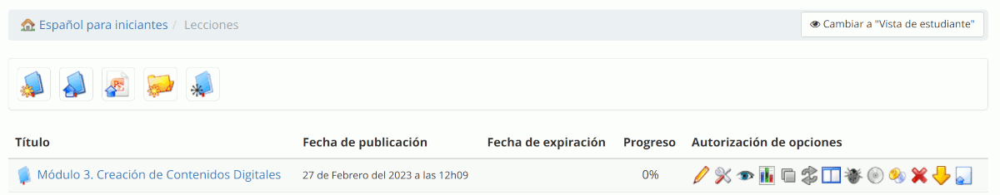
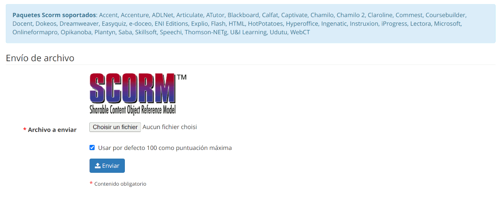

# Importar AICC y SCORM

Chamilo permite la importación de contenidos que usan estándares como [SCORM](http://fr.wikipedia.org/wiki/Sharable_Content_Object_Reference_Model) y [AICC](http://fr.wikipedia.org/wiki/Aviation_Industry_CBT_Committee). 

Importar este tipo de documentos no podría ser más sencillo. 

Haz clic sobre el icono de importación de lecciones  en la página de _Lecciones_:

_Ilustración: Lecciones - Lista_

Haz clic en _**Seleccionar archivo**_ para seleccionar el documento deseado en tu disco duro y _enviar_ para subirlo.

_Ilustración: Lecciones - Importación SCORM_

Eso es todo. Has importado un curso listo para ser utilizado.

> **Nota** : Chamilo 1.11 soporta SCORM en su versión 1.2 exclusivamente. Si elementos del código permiten tener un soporte parcial de SCORM 2004 (también llamado SCORM 1.3), este soporte parcial no permite garantizar el funcionamiento correcto de todos los intercambios entre Chamilo y el contenido SCORM 2004.

## El formato SCORM

El formato SCORM, como el formato AICC/HACP, permite importar lecciones enteras elaboradas con herramientas externas.

Al importar una lección SCORM, el contenido se despliega como una lección normal de Chamilo, con su índice en la parte 
izquierda, pero cada item de la lección es un contenido que puede incluir interactividad y personajes animados, además
de registros de actividad que pueden ser incluidos dentro del seguimiento clásico de una lección de Chamilo.

### Porque SCORM 1.2

Chamilo *no* soporta de manera completa la versión 2004 (también llamada 1.3) de SCORM, porque se trata de una versión
que añade funcionalidades poco usadas. Si bien estas funcionalidades (principalemente la posibilidad de elaborar 
lecciones adaptativas) tienen valor, el hecho que sean complejas implementar reduce su adopción, y por lo tanto su interés.

Chamilo soporta las siguientes llamadas SCORM, aunque los objetivos y las interacciones no necesariamente estén activos:
- LMSGetValue('cmi.student_demographics.first_name')
- LMSGetValue('cmi.student_demographics.last_name')
- LMSGetValue('cmi.core._children')
- LMSGetValue('cmi.core.entry')
- LMSGetValue('cmi.core.exit')
- LMSGetValue('cmi.core.session_time')
- LMSGetValue('cmi.core.lesson_status')
- LMSGetValue('cmi.core.student_id')
- LMSGetValue('cmi.learner_id') (SCORM 2004)
- LMSGetValue('cmi.core.student_name')
- LMSGetValue('cmi.learner_name') (SCORM 2004)
- LMSGetValue('cmi.core.lesson_location')
- LMSGetValue('cmi.core.total_time')
- LMSGetValue('cmi.core.score._children')
- LMSGetValue('cmi.core.score.raw')
- LMSGetValue('cmi.core.score.max')
- LMSGetValue('cmi.core.score.min')
- LMSGetValue('cmi.core.score')
- LMSGetValue('cmi.core.credit')
- LMSGetValue('cmi.core.lesson_mode')
- LMSGetValue('cmi.suspend_data')
- LMSGetValue('cmi.launch_data')
- LMSGetValue('cmi.objectives._children')
- LMSGetValue('cmi.objectives._count')
- LMSGetValue('cmi.objectives.x.id')
- LMSGetValue('cmi.objectives.x.score')
- LMSGetValue('cmi.objectives.x.status')
- LMSGetValue('cmi.objectives.x.score._children')
- LMSGetValue('cmi.objectives.x.score.raw')
- LMSGetValue('cmi.objectives.x.score.max')
- LMSGetValue('cmi.objectives.x.score.min')
- LMSGetValue('cmi.student_data._children')
- LMSGetValue('cmi.student_data.mastery_score')
- LMSGetValue('cmi.student_data.max_time_allowed')
- LMSGetValue('cmi.interactions._count')
- LMSGetValue('cmi.interactions._children')
- LMSSetValue('cmi.core.score.raw')
- LMSSetValue('cmi.core.score.max')
- LMSSetValue('cmi.core.score.min')
- LMSSetValue('cmi.core.lesson_location')
- LMSSetValue('cmi.core.lesson_status')
- LMSSetValue('cmi.completion_status')
- LMSSetValue('cmi.core.session_time')
- LMSSetValue('cmi.score.scaled') (SCORM 2004)
- LMSSetValue('cmi.success_status')
- LMSSetValue('cmi.suspend_data')
- LMSSetValue('cmi.core.exit')
- LMSSetValue('cmi.exit') (SCORM 2004)
- LMSSetValue('cmi.interactions.x.id')
- LMSSetValue('cmi.interactions.x.time')
- LMSSetValue('cmi.interactions.x.type')
- LMSSetValue('cmi.interactions.x.correct_responses')
- LMSSetValue('cmi.interactions.x.weighting')
- LMSSetValue('cmi.interactions.x.student_response')
- LMSSetValue('cmi.interactions.x.result')
- LMSSetValue('cmi.interactions.x.latency')
- LMSSetValue('cmi.objectives.x.id')
- LMSSetValue('cmi.objectives.x.score')
- LMSSetValue('cmi.objectives.x.status')
