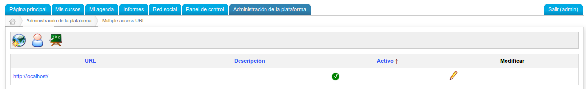
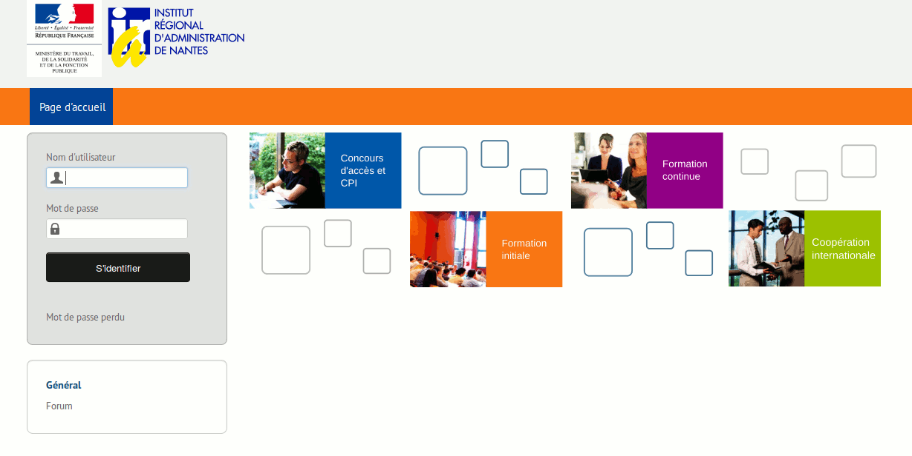
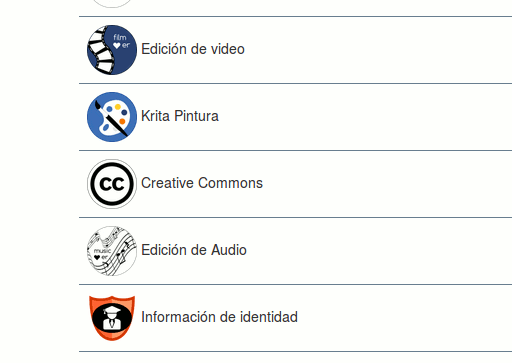

# Funcionalidades globais

## Multi-URL 

Chamilo incorpora una discreta pero práctica funcionalidad pensada para el caso de que su plataforma Chamilo vaya a ser usada por varias categorías de usuarios. En este caso, puede ser necesario considerar un segundo portal con otro nombre de dominio, diferente aspecto y diferentes cursos y usuarios. En suma, se trata de varios espacios espacios independientes que comparten muchos de sus contenidos y todo su código.

### Caso de uso – Facultades de la Universidad 

Imagine que 12 facultades de su universidad quieren mostrar su propio portal con una apariencia distinta \(logotipo de cabecera y color de fondo diferentes, ...\). Cada facultad tendrá sus propios docentes, que ocasionalmente también podrán impartir sus clases en otras facultades. Con los alumnos ocurre algo parecido, pues aunque lo normal es que estén vinculados a una sola facultad, en algún caso podrán estarlo a más de una. Por último, el contenido de los cursos impartidos en las distintas facultades suele ser diferente, aunque puede haber casos específicos en los que haya cursos comunes.

### Caso de uso – Marca corporativa 

Imagine que su empresa ofrece cursos de salud y seguridad para varios clientes. Suponga que uno de sus clientes es Coca-Cola® y el otro es Pepsi®. Tal vez estos clientes no deseen que se muestre que están usando el mismo curso o utilizando el mismo portal para sus capacitaciones. O simplemente, para ahorrarse trabajo le gustaría volver a utilizar el mismo curso, pero sin que contenga las contribuciones de los alumnos de la otra empresa...

### La solución 

Para resolver estos casos le ofrecemos una solución _multi-URL_. Al permitir multi-URL, se activará el siguiente mecanismo:

* se utilizará el mismo código fuente \(por lo tanto el mantenimiento es el mismo\)
* se utilizará la misma base de datos \(por lo tanto se evita la duplicación de los datos\)
* un portal “maestro” \(no usado directamente por sus clientes\), permitirá definir portales “esclavos”.
* cada curso se creará dentro del portal “esclavo” y sólo será visible dentro de ese portal
* cada usuario se creará dentro de un portal “esclavo”. Sólo será visible dentro de ese portal y sólo tendrá acceso a ese portal
* cada portal esclavo usará un nombre de dominio diferente \(o un subdominio diferente\)
* cada portal podrá utilizar su propio estilo gráfico
* uno \(o más\) administradores podrán ser asignados a cada portal esclavo. Este/os administradores no tendrán acceso a la configuración global, ni a los usuarios, ni a los cursos de otros portales
* una sesión podrá utilizar un curso global, pero cada sesión no existirá en más de un portal

Utilizando la misma base de datos se beneficiará de estas "características extra":

* un curso puede ser “global” y ser usado a través de sesiones en todos los portales esclavos
* un usuario \(alumno, docente o administrador\) puede tener acceso a otros portales si así lo configura el administrador global.

### Instalación 

Para configurar el modo multi-URL, tendrá que:

* acceder a la configuración de su servidor web
* acceder a la definición de sus nombres de dominio
* acceder al archivo de configuración de Chamilo

El proceso de instalación es el siguiente:

* _editar el archivo main/inc/conf/configuration.php_ _quitando el marcador de comentario antes de la línea:_ _$ \_configuration \['multiple\_access\_urls'\] = true;_
* añadir la línea “1,1” en la tabla de _access\_url\_rel\_user_
* añadir directivas SiteAlias dentro de su VirtualHost de Apache
* definir nombres de dominio o sub-dominio \(DNS\) para que apunten a su servidor
* ir a la página de administración de Chamilo y seguir el enlace múlti-URL del portal
* redefinir su URL principal \(reemplace localhost\) y añadir el deseado, luego agregar y habilitar un administrador para cada uno de ellos

Ilustración 75: Administración - Multi-URLs

El resultado de una instalación multi-URL puede quedar muy bonito si cuenta con los servicios de un diseñador profesional. Aquí presentamos un ejemplo con 3 facultades de un mismo instituto…

## Videoconferencia 

Como se indicó anteriormente en la sección de _plugins_ de esta guía \(ver el capítulo 3.1.16 en la página 37\), la herramienta de videoconferencia no se entrega junto con Chamilo. Usted puede instalarla fácilmente y enlazarla a Chamilo mediante el plugin para _BigBlueButton_, pero esto requerirá un servidor dedicado.

Para instalar _BigBlueButton_, le recomendamos que siga las instrucciones de la página web del proyecto: [http://bigbluebutton.org](http://bigbluebutton.org/)

Una vez esté instalada y funcionando la videoconferencia, usted tiene que saber la dirección URL pública \(a veces sólo una dirección IP\) y la clave secreta. Encontrará la clave secreta en /var/lib/tomcat6/webapps/bigbluebutton/WEB-INF/classes/bigbluebutton.properties o usando el comando bbb-config --salt

Cuando sepa su dirección pública y su clave secreta, vaya a la sección de plugins en la pestaña de administración de Chamilo. Active el plugin _BigBlueButton_ y proceda a guardar. **Actualice la página** para que la nueva categoría “Extra” de configuración aparezca en la barra de acciones en la parte superior de la página \(una varita mágica\) y haga clic en ella. Introduzca la información del servidor de videoconferencia. Ahora sólo tiene que comprobar la integración entrando en un curso y haciendo clic en la herramienta videoconferencia.

Los docentes de los cursos y los tutores son los únicos que pueden **iniciar** una sala de videoconferencia. También son los únicos que tienen la condición de moderador en Chamilo.

Los alumnos no pueden conectarse en videoconferencia si su docente no ha iniciado previamente una sala \(si lo intentan sólo se volverá a cargar la página principal del curso\).

Si no puede instalar su propio servidor de videoconferencia, no dude en ponerse en contacto con los proveedores oficiales de Chamilo que previo pago podrán suministrarle un acceso a sus servidores de videconferencia.

## Chamilo Rapid 

La conversión de presentaciones de PowerPoint® o Impress® a lecciones es relativamente compleja para instalarse de una manera correcta. No obstante hay un atajo conocido: instalar una versión de LibreOffice 4 y ejecutar la orden siguiente:

_sudo_ _soffice_ _-nologo -nofirststartwizard -headless -norestore -invisible “-accept=socket,host=localhost,port=2002,tcpNoDelay=1;urp;”_

Cualquier explicación quedaría en gran parte fuera del contexto de esta guía, pero esta receta funciona bien en un servidor con Ubuntu.

Si usted no es capaz de instalar este servicio no dude en preguntar a uno de nuestros proveedores oficiales para que le brinden ayuda o previo pago pongan a su disposición sus servidores.

## Actualizar las hojas de estilo 

Como se mencionó en la sección 3.1.14 Hojas de estilo de la página 36, los estilos de Chamilo se pueden actualizar a través de una simple copia de cualquiera de los estilos existentes ubicados en _chamilo/**app/Resources/public/**css/\_\_themes/_. Usted encontrará una serie de estilos en este directorio, por ejemplo, _chamilo\_green_, que se puede copiar, renombrar y modificar a voluntad. Para probarlo, basta con ir a la sección de Hojas de Estilo de la página de configuración del portal, subir su estilo en un archivo .zip, seleccionar el estilo de subida y finalmente guardar.

## Competencias y certificados 

Chamilo 1.9 introducía un nuevo concepto en términos de gestión de competencias y extendía el concepto de certificado de aprendizaje introducido en las primeras versiones de Chamilo.

A partir de la versión 1.10, se puede hacer un uso avanzado de las funcionalidades de gestión de competencias y de certificados.

Para activar las funcionalidades correspondientes, es necesario activar las opciones de “Gestión de competencias” y de “Publicación de certificados”, las cuales se pueden encontrar fácilmente buscando “competencia” y “certificado” en la barra de búsqueda de los parámetros de configuración.

Estas funcionalidades están vinculadas profundamente con la herramienta de evaluaciones en los cursos, por lo que será necesario tener habilitados unos cursos con la posibilidad de lograr un certificado. Referirse al manual docente para esta parte.

Una vez activada la herramienta de competencias, aparecerá un bloque más en la página de administración del portal.

Al inicio, será necesario importar o generar competencias. La “Rueda de competencias” quedará vacía hasta que algunas competencias hayan sido creadas.

Para evitar tomarnos mucho tiempo elaborando una lista de competencias, podemos usar el archivo propuesto como ejemplo en la página “Importar competencias”. Bastará con darle clic al fichero CSV de ejemplo, descargarlo en nuestra máquina y seleccionarlo en el botón de selección de archivos.

Una vez este paso completado, podemos regresar a la página de administración y visualizar la rueda de competencias, que se verá algo similar a lo siguiente \(en este caso hemos creado una lista de competencias en español, la lista por defecto siendo disponible únicamente en inglés\).

La visualización en rueda es similar a una visualización en árbol jerárquico, doblado sobre el mismo, o como un abanico totalmente doblado sobre el mismo.

Esta rueda representa las competencias, ordenadas de manera jerárquica. Usualmente, los dos o tres primeros niveles servirán para la categorización de las competencias, y no serán competencias en sí, pero esto queda libre para el equipo de gestión de competencias decidir. Solo se muestran a primera vista los 4 primeros niveles de competencias, pero la rueda soporta cualquier cantidad de niveles.

Al dar clic en cualquier competencia de la rueda, la página se refresca para centrar la rueda sobre la competencia seleccionada y mostrar solamente sus competencias “hijas”.

Como se ve en la primera captura, existe un código de color \(y su leyenda\) para las competencias de la rueda. Para que un alumno pueda lograr una competencia, es necesario asociarla con una evaluación dentro de un curso.

Para hacerlo, existen dos métodos:

* la más precisa: ir al curso en cuestión y editar la evaluación para asociarla con la competencia
* la más rápida: dar clic derecho en la competencia, dar clic en “Editar” y seleccionar la evaluación asociada

Usaremos el segundo método en este caso.

En el formulario, al seleccionar alguna evaluación, se hará la asociación. Ahora, al lograr terminar el curso \(o los objetivos del curso tales como ordenados en la evaluación\), el alumno habrá logrado la competencia correspondiente también.

Ojo que el alumno **deberá obligatoriamente** pasar por la herramienta de evaluaciones para que se haga efectivo su logro de la competencia \(tal como es el caso para los certificados\).

Luego de asociar la competencia a un curso, si regresamos a la rueda de competencias, la visualizaremos con una de las competencias marcadas en naranja, simbolizando que, en este portal Chamilo, se puede lograr esta competencia a través de un curso.

Una vez los alumnos hayan empezado a lograr competencias, estas se mostrarán en el perfil de red social de cada uno. También será posible para el administrador \(y el administrador de recursos humanos\) hacer búsquedas sobre las competencias, como se presenta a continuación, usando el menú de la izquierda \(y confirmando la selección de cada competencia en la lista antes de buscar\).

En este caso \(tomado desde otro portal\), hemos buscado un perfil con dos competencias, una de las cuales está adquirida por el usuario Pedro Perez.

El sistema nos indica que le “falta una competencia para corresponder” a nuestra búsqueda. Me indica, no obstante, que este alumno tiene ya dos competencias, pero la segunda no corresponde a mi búsqueda.

Si esta búsqueda corresponde a un perfil que busca con frecuencia, puede guardarla con un nombre propio, y regresar luego para ver si más personas tienen el perfil buscado.

## OpenBadges 

OpenBadges es un estándar abierto de representación e intercambio de competencias, representadas por insignias para facilitar su entendimiento. OpenBadges funciona con un servidor de “recolección de datos” configurable en configuration.php. Por defecto, se trata del Backpack de Mozilla.

Para crear una insignia OpenBadges, necesito tener una competencia. Para ello, puedo visitar la entrada “Gestionar las competencias” en la página principal de administración, o bien puedo usar la entrada “Insignias”.

Para la competencia que quiero ilustrar, doy clic en el botón “Crear insignia”.

Esto me redirige hacia una página de edición de la insignia y la competencia, que contiene dos campos más que la competencia misma:

* _Imagen_, en el cual se subirá la imagen representando la competencia
* Criterios para lograr la insignia es un dato requerido por el estándar OpenBadges: se trata de describir cuales fueron los retos culminados para obtener esta insignia, lo que permitirá a personas externas saber cuales fueron las competencias que el usuario tuvo que demostrar

También existe un botón “Diseñar una nueva insignia”, y es que pensamos que el usuario promedio no tendrá a su disposición un diseñador que pueda trabajar sobre una base inicial de insignias.

Al dar clic en el botón de diseño, se abre una nueva ventana emergente con el servicio de MyKnowledgeMap que permite diseñar su propia insignia, descargarla, y luego volver a subira.

Una vez estas operaciones ejecutadas, podremos visualizar este badge en miniatura en la lista de badges.

Finalmente, el alumno podrá visualizar este badge en su red social, seleccionar uno de ellos, ver su ficha de logro del badge y exportar su competencia a un “Backpack” especial de OpenBadges. Por defecto, se usa el BackPack de Mozilla en [https://backpack.openbadges.org/](https://backpack.openbadges.org/)

A partir de ahí, los alumnos pueden exportar sus competencias para mostrarlas, por ejemplo, a LinkedIn.

Queda mucho por decir sobre esta herramienta, los certificados y los OpenBadges, pero esta introducción debería permitirle iniciar su uso de la herramienta. Esperamos extender esta sección en las próximas versiones.

Podrá encontrar más información sobre la generación de evaluaciones y certificados en el manual del profesor.

