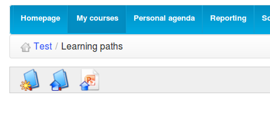
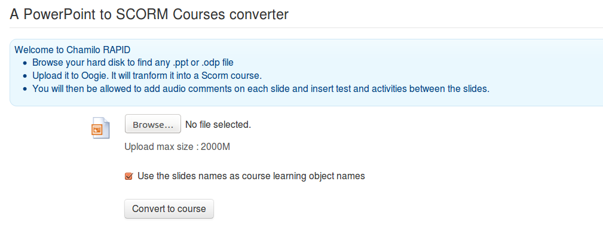

## Chamilo Rapid {#chamilo-rapid}

The PowerPoint® or Impress® presentations conversion to learning paths is relatively complex to install the right way. There&#039;s only one known short-cut: install an OpenOffice.org or LibreOffice version 3 and the _screen_ command.

$ sudo apt-get install libreoffice screen

Then launch the following commands

$ screen

_$_ _sudo soffice -accept=__”__socket,host=__127.0.0.1__,port=2002,tcpNoDelay=1;urp;”_ _-headless -nodefault_ _-nofirststartwizard_ _-nolockcheck -nologo_ _-norestore_ _&amp;_

ctrl-a + ctrl-d

Any finer explanation would largely be out of the context of this guide, but this recipe works well on Ubuntu server.

**Note**: the installation of the video-conference server already includes the installation of the _OpenOffice.org_ server on port 8100, so if you have installed it, you won&#039;t need the command above. Just configure Chamilo to use the presentations conversion server from port 8100.

Once configured and running, you will be able to convert PPT from inside your courses&#039; learning path tools.

Illustration 87: Rapid conversion icon in learning paths tool

Illustration 88: Learning path import PPT screen

Once imported this way, a PowerPoint or Impress presentation will be transformed to a full learning path, ready to be further edited and structured, then published to learners.

If you&#039;re stuck with the installation of this service, don&#039;t hesitate to ask one of our official providers to give you a hand or rent you one of their pre-configured servers.