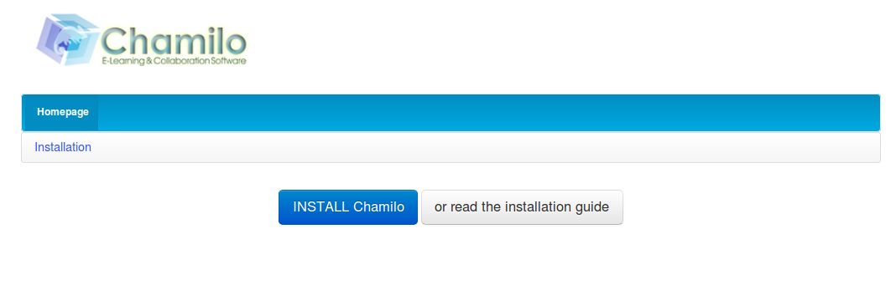

### Launching the installation wizard {#launching-the-installation-wizard}

Once the files have beencopied to the server, point your browser at « http://www.mydomain.com/chamilo » or, locally, at the « http://localhost/chamilo », depending on where exactly you put the directory.

If you were able to configure a VirtualHost in your web server&#039;s configuration, you are better off loading directly an address of this form: « http://www.virtualhost.com/ » without the _chamilo_ suffix_._VirtualHosts are out of the scope of this guide, but you can learn about them from Apache&#039;s documentation website[^7] or Nginx&#039;s[^8] (if you use it).

In the following screenshots, we install Chamilo 1.9.4\. The installation of all versions of 1.9.* are almost exactly the same, so the procedure is also valid for 1.9.0, 1.9.2, 1.9.4, 1.9.6 and 1.9.8.

Illustration 2: Installation – Welcome screen

You must then follow a series of steps to indicate your platform parameters. These steps are almost identical for local and remote installations.

[^7]: http://httpd.apache.org/docs/2.2/sitemap.html#vhosts

[^8]: http://wiki.nginx.org/ServerBlockExample