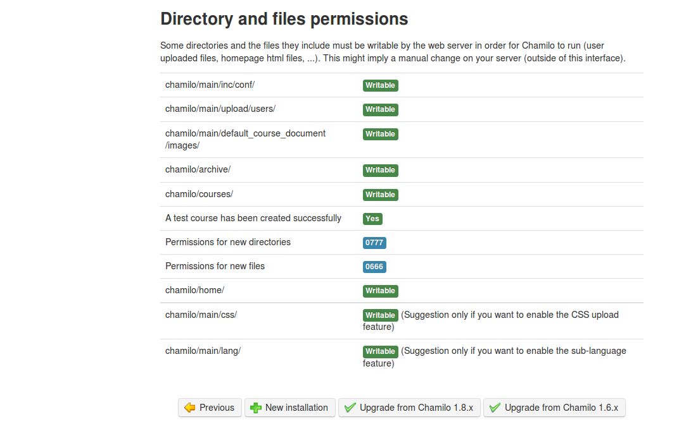

#### Step 2 of 6 : Prerequisites {#step-2-of-6-prerequisites}

This step checks your server has all the required elements for a complete and correct installation of Chamilo.

Illustration 4: Installation - Prerequisites

The prerequisites already fulfilled by your system are marked in **green**, the mandatory but non-satisfied ones are marked in **red** and the ones non-satisfied but not mandatory either are marked in **orange**.

Almost all prerequisites relate to the PHP installation and offer links to more details. The recommended parameters represent variables that you can modify in your PHP configuration (_php.ini_[^9]) or inside the VirtualHost configuration.

At the end of the prerequisites page, you will find a _Permissions on directories and files_ section.

Illustration 5: Installation - Prerequisites (end)

By default under GNU/Linux, writing is not authorized on directories. You must change files accesses to optimise the security and give the sufficient permissions to the user running the web server. These ensure confinement of permissions during the execution of a service (in this case _Apache_) and avoid a cracker to be able to take control of your server too easily.

Under Windows, this is generally easier by default (but much less secure) and the permissions are already sufficient (but too permissive).

**Note** : Chamilo is frequently reviewed (at least once a year) against security flaws that would endanger your server. You can be kept aware of the latest security flaws found and fixed by subscribing to our dedicated security mailing list: [http://lists.chamilo.org/listinfo/](http://lists.chamilo.org/listinfo/security)[security](http://lists.chamilo.org/listinfo/security) or on [http://support.chamilo.org/projects/chamilo-18/wiki/Security_issues](http://support.chamilo.org/projects/chamilo-18/wiki/Security_issues). Alternatively, we have a Twitter feed for Chamilo&#039;s security-related news: [http://twitter.com/chamilosecurity](http://twitter.com/chamilosecurity)Chamilo has an excellent track record of fixing every security flaw and publishing patches to its users within 4 days of being reported. You can check our public record on Secunia&#039;s website[^10]

Locally, on Ubuntu, go to the directory where the _Chamilo_ directory is. Give it sufficient permissions to user _www-data_ (the web server user under Ubuntu) and reload the page in your browser. If you use another operating system, you might need to update the following command a little bit.

Ex.: user@server:/var/www$ chown -R www-data:www-data chamilo/

These permissions are nowhere near secure, and we assume you will seek advise about permissions to a properly qualified Linux administrator. Security should matter to you, but we cannot possibly cover all cases of permissions and servers out there just with this guide.

Click on « + New installation ».

**_Note_** : if you run an update of a previous version of Chamilo, this chapter is not the right one for you. You should rather check out chapter 2.3 : Updating Chamilo. We also recommend you to read the installation and update guide of Chamilo, available inside the **documentation** directory of your Chamilo package.

[^9]: http://php.net/manual/en/ini.core.php

[^10]: http://secunia.com/advisories/product/34198/