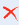
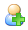
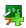

## Managing the sessions {#managing-the-sessions}

Managing the sessions can be done with icons mostly familiar, and a few new ones...

| Icons | Features |
| --- | --- |
|  | Update the settings/details of a session |
|  | Remove a session (after confirmation) |
|  | Subscribe users to a session |
|  | Add courses to a session |
|  | Add a session to a category |

Tableau 1: Administration – Sessions management icons