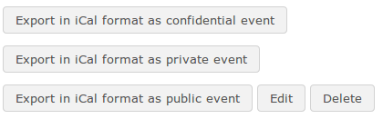

## Import and export events {#import-and-export-events}

The Chamilo Agenda tool supports the import and export of standard calendar files (Outlook, iCal). To import an Outlook file, click the _Import Outlook_ icon  in the tool-bar in the course _Agenda_ and upload the relevant file as prompted. Then return to the _Agenda_ using the _Agenda_ icon .

Users can export events as iCal from the pop-up window that appears when they click on an event to view details. They can select the appropriate iCal format (_confidential, private, public_) for the export at the bottom of the pop-up window, and teachers can edit or delete the event using the appropriate button in the pop-up window:

Illustration 144: Export, edit or delete an event

(**Note**: Teachers only have access to the delete/edit buttons via the course Agenda from the course homepage – not via the Personal Agenda tab, where, like learners, they can only view/export events).