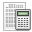

# Assessments {#assessments}

The _Assessments_ tool  is where you, as teacher, can establish success criteria for the course (i.e. the pass-mark, merit rankings etc.), involving the allocation of weightings to various activities, tests etc. You can also use the assessments tool to generate and issue certificates to learners on successful completion of the course. Click on the tool to display the main _Assessments_ page which may (once set up for the course) look like this to the teacher.

Illustration 101: Assessments – Example teacher view

It allows you to prepare an overview report compiling learners&#039; achievements in the course overall, drawing on the results of activities undertaken in virtually every part of the online course, but also including “external” activities undertaken in your classroom, outside of the online course.

The learner can use the assessments tool as a “grade-book” to monitor his own progress, and will see a simpler, personalized view when he clicks on the _A__ssessments_ tool which will look something like this:

Illustration 102: Assessments – Example learner view

_(Note: Before looking further into the assessments tool, make sure you have at least one learner subscribed to your course. (This is why we cleverly put the_ _Users_ _chapter before this one!). In this chapter, it will be much easier to follow the examples if you already have learners subscribed and a series of activities created. Don&#039;t forget – until you choose to allow it, the user will not be able to see the course anyway, as long as is configured as closed.)_