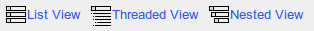

## Using forum views {#using-forum-views}

Depending on the complexity of exchanges on the forums, several display modes can be used to simplify reading and answering discussion threads.

*   **List view** : simply shows messages in chronological order,

*   **threaded view** : shows only one answer thread at a time,

*   **nested view** : uses the threaded view but displays a complete subject.

Illustration 68: Forum – Display modes