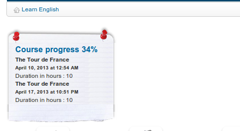

## Thematic advance settings {#thematic-advance-settings}

This _Thematic advance_ section  allows you to choose which options for the _Course progress_ will be visible on the course homepage (on the right-hand side of the introduction section).

Illustration 179: Courses settings - Course progress

These options require a proper understanding of the course progress tool. The results of the third option, for example, will be similar to the ones show in the illustration below).

Illustration 180: Course progress – Display on course homepage