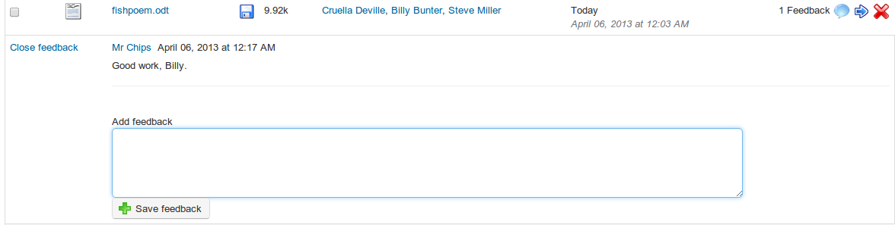

## Read and add comments on a file {#read-and-add-comments-on-a-file}

*    click the _Comment_ icon next to the file&#039;s name,

*   read the existing comments,

*   add a feedback comment in the text area available,

*   click the _Save feedback_ button.

illustration 147: Dropbox - Comments