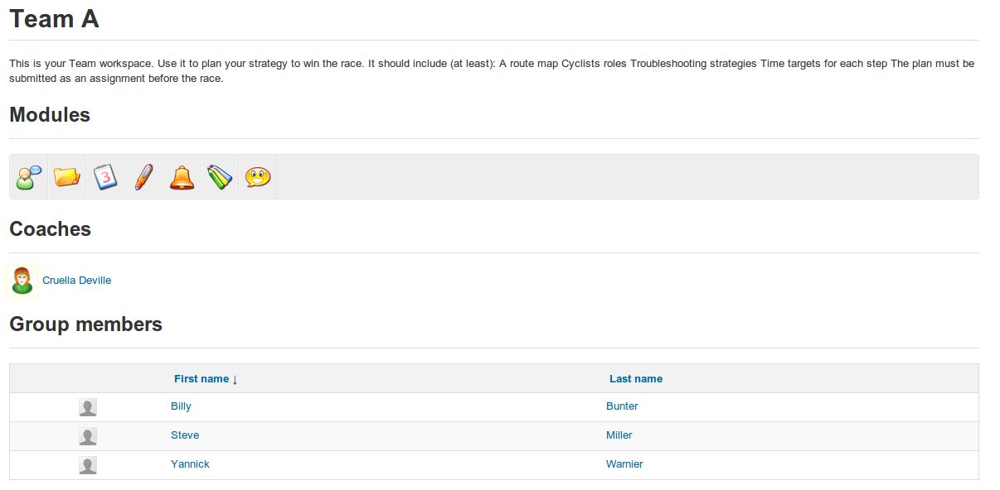

## Getting into a group space {#getting-into-a-group-space}

Group members can access the group&#039;s “workspace” simply by clicking the name of the relevant group in the listing on the main _Groups_ page. The page will display the group description (e.g. a list of aims and objectives) and details of membership, as well as it&#039;s own “toolbar” of links to the group&#039;s various tools (_Forums, Documents, Agenda, Assignments, Announcements, Wiki_ and _chat)_ which link to the various (private) group workspaces:

Illustration 152: Groups – Group space

From the group space, you can query a learner&#039;s information sheet by simply clicking on her name in the list of members in the lower part of the page.