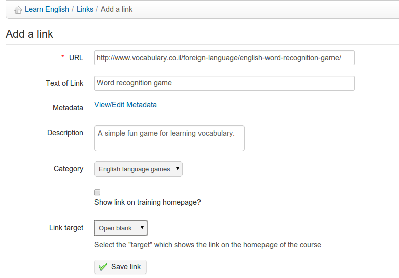

## Links {#links}

A link can be added in a category or at the root level:

Illustration 123: Links - Add link

To add a link:

*   Click the _Add a link_ icon 

*   Add the link&#039;s URL,

*   Give it a label,

*   Add a description of what is on the other side of the link, if desired,

*   Select a category if desired,

*   Choose whether to show the link on the course homepage or not,

*   Click the _Save link_ button.