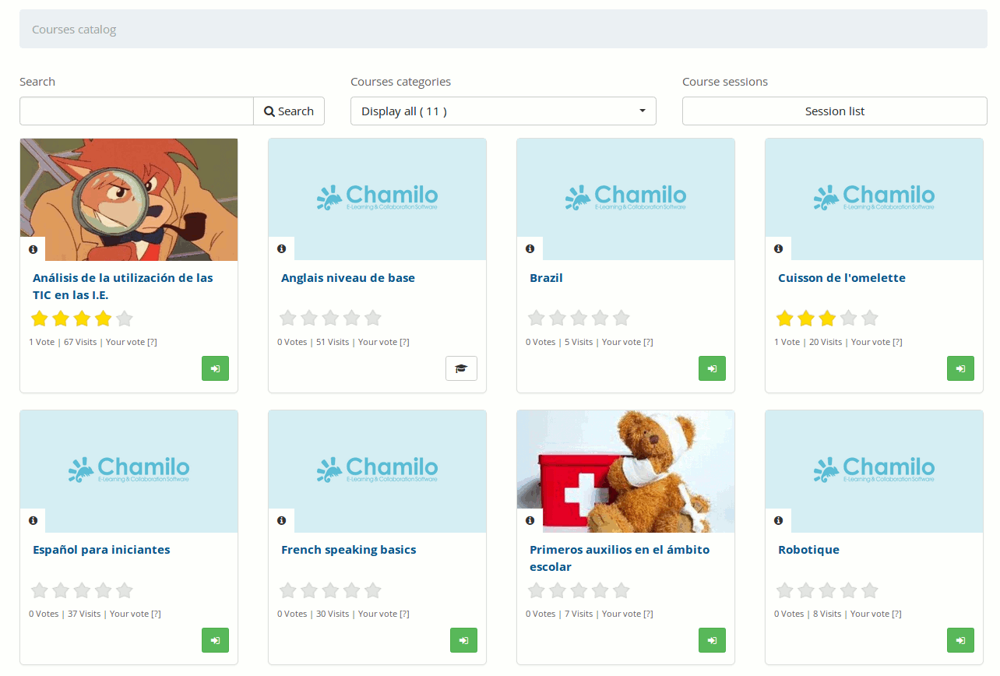

## Subscribing to other courses {#subscribing-to-other-courses}

Teachers and students can subscribe to courses. When a teacher subscribes to another course by himself, he is considered student in this course, and will thus not have access to the normal teacher tools. If you want to register to be registered to someone else&#039;s course as a teacher, you will have to ask the current teacher of that course or the administrator to register you, as a teacher, to that course.

Clicking on the _Courses catalog_ link, and a list of courses will appear. You can look for the course in the suggested categories, or find it by searching for all or part of the course title via the search box on the top part of the page. If this portal uses sessions, a sessions catalog is also made available

Illustration 23: Courses catalog

Once you’ve found your the course, click on the green _Subscribe_ icon to subscribe to it. The subscription gives the user subscribing **learner** status.