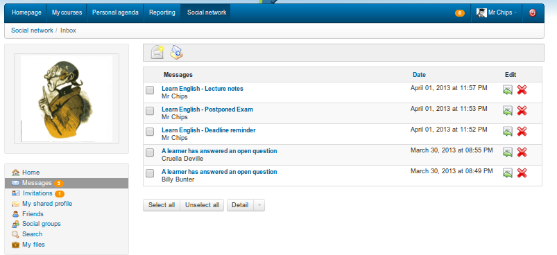

## Internal messaging {#internal-messaging}

From the _Social network_ tab (left menu) the _Messages_ entry allows you to send or receive messages. It is similar to most messaging tools.

Illustration 189: Social network – Internal messaging - Inbox

To write a message to another user (or a friend) subscribed to the platform:

*   click the _Messages_ link below your picture,

*   click the _Compose message_ icon ,

*   Chamilo will auto-complete the send-to field with known contacts,

*   enter the subject and message (optionally you can add an attached file),

*   click the _Send message_ button.

If the recipient has entered their email in their profile, the message will also go automatically go to their email address.

**Note**: If the other user has chosen to, the message will also be sent to his e-mail as a notification of internal message. However, he will have to enter the platform to answer you.