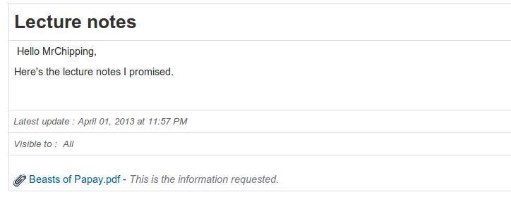

# Voeg een aankondiging toe

Vanaf de hoofdaankondigingspagina:

* 

  Afbeelding: Voeg een aankondiging toe

  klik op het pictogram _ Een aankondiging toevoegen _ ,

* de aankondiging wordt standaard naar alle gebruikers verzonden, maar het is mogelijk om de lijst met ontvangers te bewerken door op de link _visible to_ te klikken 
* de aankondiging kan per e-mail naar de cursusgebruikers worden gestuurd \(vink het vakje _Stuur deze aankondiging per e-mail naar geselecteerde groepen/gebruikers_ aan\),
* een aankondigingsonderwerp toevoegen,
* schrijf de belangrijkste aankondiging met behulp van de editor,
* voeg desgewenst een bijlage toe,
* klik op Mededeling verzenden.

Opmerking: sinds versie 1.8.8.4 kunt u tags gebruiken in uw aankondigingen \(kopieer en plak ze\). Deze tags worden automatisch vervangen door de overeenkomstige waarde wanneer ze per e-mail worden verzonden of aan gebruikers op het platform worden weergegeven.

Aankondigingen verschijnen als volgt voor ontvangers op het platform:

Afbeelding: Aankondigingen - leerlingweergave

