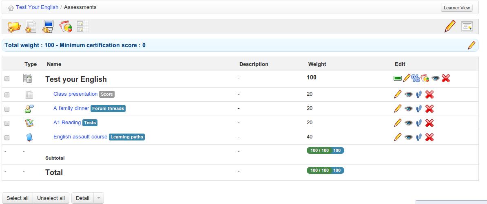

# Assessments

Das Tool _Assessments_  ist der Ort, an dem Sie als Lehrer Erfolgskriterien für den Kurs festlegen können \(dh die Pass-Marke, Verdienst-Rankings usw.\), einschließlich der Zuordnung von Gewichtungen zu verschiedenen Aktivitäten, Tests usw. Sie können das Bewertungstool verwenden, um Zertifikate an Lernende zu generieren und auszustellen erfolgreicher Abschluss des Kurses. Klicken Sie auf das Tool, um die Hauptseite von _Assessments_ anzuzeigen, die dem Lehrer (einmal für den Kurs eingerichtet\) so aussehen kann.

_Illustration 101: Assessments — Beispiel für Lehreransicht_

Sie können damit einen Übersichtsbericht erstellen, in dem die Erfolge der Lernenden im Kurs insgesamt zusammengestellt werden, der sich auf die Ergebnisse der Aktivitäten stützt, die in praktisch jedem Teil des Online-Kurses durchgeführt wurden, aber auch die “external” -Aktivitäten, die außerhalb des Online-Kurses in Ihrem Klassenzimmer durchgeführt werden.

Der Lernende kann das Bewertungstool als “grade-book” verwenden, um seinen eigenen Fortschritt zu überwachen, und wird eine einfachere, personalisierte Ansicht sehen, wenn er auf das Tool _A\_ _ssessments_ klickt, das ungefähr so aussieht:

_Illustration 102: Assessments — Beispiel aus der Sicht der Lernenden

_ \(Hinweis: Bevor Sie sich das Assessment-Tool genauer ansehen, stellen Sie sicher, dass mindestens ein Teilnehmer Ihren Kurs abonniert hat. \(Deshalb haben wir das_ _Users_ _Kapitel geschickt vor dieses gestellt!\). In diesem Kapitel wird es viel einfacher sein, den Beispielen zu folgen, wenn Sie bereits Teilnehmer abonniert und eine Reihe von Aktivitäten erstellt haben. Vergessen Sie nicht - solange Sie sich nicht dafür entscheiden, dies zuzulassen, kann der Benutzer den Kurs sowieso nicht sehen, solange er als geschlossen konfiguriert ist.\) _