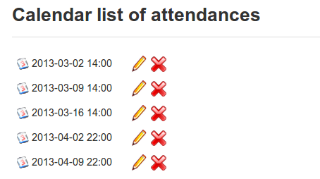

# Create an attendance sheet

To get started, click the _Create a new attendance list_ icon :

_Illustration: Attendances – New attendances form_

Fill in the main title/description fields and tick if you wish to grade the attendances. If you do so you can select an assessment to link attendances to, write a column header for the report and add a

_Illustration: Attendances – Intermediary step for dates creation_

weighting to activities. Finally, click _save_ and you will be prompted to add a time and date:

Selecting _repeat date_ allows to you quickly generate a series dates and time for regular sessions e.g. weekly at 22.00 hrs. Click _Save_ again to view a list of the dates chosen:

_Illustration: Attendances calendar_

These are fully editable \(e.g. if one week is a holiday, delete\) and, equally, you can add to the dates/times using the _add a date and time_ icon  in the toolbar. You can also clear the entire list of dates and times using the _clear the calendar of all lists_ icon . To view the attendance sheet for the relevant activity click the A_ttendance sheet_ icon 

