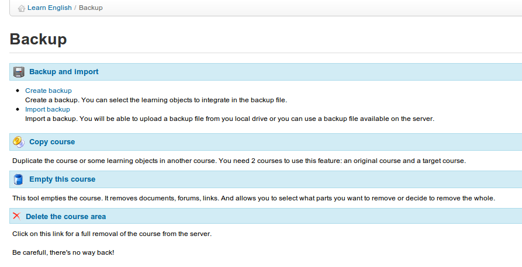

# Backup

Chamilo unterscheidet zwischen Wartungstools und Kurseinstellungen, um die Kurswartung und das Backup zu vereinfachen. Das Löschen, Leeren, Kopieren, Speichern oder Wiederherstellen des Inhalts eines Kurses \(teilweise oder vollständig\) kann mit dem Tool _Backup_ schnell und effizient ausgeführt werden :

_Illustration 181: Backup - Allgemeinar_

> **Hinweis**: Funktionen zum Speichern, Kopieren, Wiederherstellen usw. wurden mit der Absicht entwickelt, **Inhalt** zu verwalten. Aus diesem Grund werden Interaktionen mit oder zwischen Benutzern nicht gespeichert. Um sie zu speichern, müssen Sie Ihren Plattformadministrator bitten, eine vollständige Sicherung des Portals durchzuführen. Wenn Sie der Administrator sind, wird dieses Verfahren im Administratorhandbuch beschrieben.