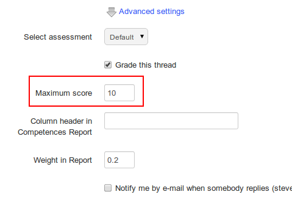

# Gib deinen Lernenden eine Punktzahl

Wenn Sie sich dafür entscheiden, ein Thema/einen Diskussions-Thread zu erzielen/zu bewerten, müssen Sie diesem Thread zunächst eine maximale Punktzahl zuweisen. Dies muss getan werden, wenn der Thread erstellt wird. Gehen Sie auf der Seite _create thread_ zu _advanced settings_ und aktivieren Sie das Kästchen _grade dieses Thread_. Eine Option zur Eingabe einer Höchstpunktzahl wird angezeigt:

_Illustration 72: Zuweisen einer Höchstpunktzahl zu einem Diskussionsthema_

Um den Beitrag eines Schülers zu einem Thread zu erzielen:

* klicken Sie auf das Symbol _Learners Liste_ 
* scrollen Sie nach unten, um die Liste der Lernenden zu sehen,
* klicke auf das _grade-aktivität_ Icon  neben dem Namen des Lernenden
* Suchen Sie auf der neuen Seite die Liste aller Beiträge \(Nachrichten\), die vom Lernenden geschrieben wurden, sowie eine statistische Tabelle, die auf denselben Beiträgen basiert.
* Geben Sie die Punktzahl ein, die Sie dem Teilnehmer zuweisen möchten: Wählen Sie mit Hilfe der Beitragsliste eine qualitative Bewertung für diese Beiträge aus. Die statistische Tabelle ermöglicht eine quantitative Bewertung der Beiträge,
* Klicken Sie auf die Schaltfläche Not _this thread_.

_Illustration 73: Forum — Markieren eines Threads_