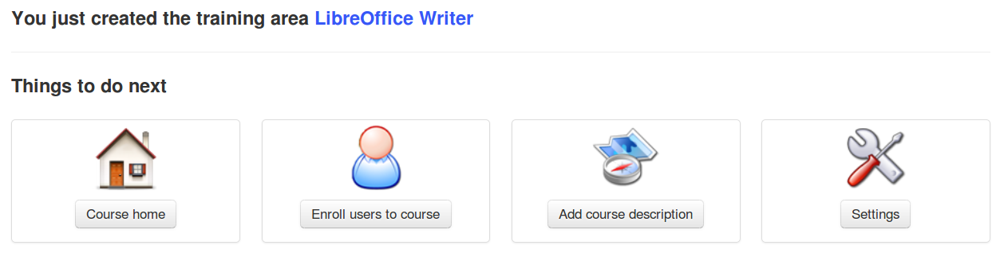

# Erstellung von Kuren

_Illustration 13: Persönliche Menüblöcke_

Das Erstellen eines Kurses ist schnell und einfach und kann auf der Seite „Meine Kurse“ erfolgen.

> **Hinweis**: Auf einigen Portalen haben Lehrer möglicherweise keine Berechtigung, neue Kurse zu erstellen, und werden einfach vom Administrator vorab erstellte Kurse zugewiesen.
> > Klicken Sie in der Seitenspalte auf _Kurs erstellen_. Füllen Sie das Pflichtfeld “Course name” aus \(siehe Abbildung 14: Erstellen eines Kurses — Kurzversion\) und klicken Sie auf die Schaltfläche. Das ist es.

Der Kurs wird vom Ersteller des Kurses und \(später\) durch die abonnierten Benutzer sichtbar sein. Standardmäßig ist die Person, die den Kurs erstellt, für die Verwaltung dieses Kurses verantwortlich. Sie wird im Allgemeinen als „**Kursbesitzer**“ oder „Kursersteller**“ bezeichnet.

Um den Kurs zu erstellen, müssen Sie nur ein einzelnes Element eingeben, also einen klaren und detaillierten Titel.

_Abbildung 14: Erstellen eines Kurses — Kurzversion_

Weitere **Optionen** \(vollständig optional\) sind verfügbar, wenn Sie auf den Button\_Erweiterte Einstellungen\_klicken:

* **a** **Kategorie** innerhalb der im Dropdown-Feld angebotenen \(dies ist optional\),
* **a** **Kurscode** Wählen Sie einen Code aus, der dem Kurstitel entspricht, der z. B. einer numerischen Klassifikation zugeordnet ist. \(n.b. Selbst wenn er in Kleinbuchstaben eingegeben wird, wird der Kurscode automatisch in Großbuchstaben geschrieben und Symbole wie _ \(-, _ und Leerzeichen\_ werden aus dem Code entfernt\),
* **das****Kurs-Admin** Diese Option wird automatisch mit Ihrem Namen gefüllt und kann nicht aktualisiert werden,
* **das** **Sprache**, die zur Anzeige der Kursumgebung verwendet wurde \(nichts hindert Sie daran, z. B. Französisch zu verwenden, selbst wenn die Plattform auf Englisch installiert ist\). Die Sprachwahl hat keinen Einfluss auf den Kursinhalt, sondern nur die Kursoberfläche
* Der Kurs kann mit irgendem**Demo-Inhalt** gefüllt werden, um dem neuen Kursadministrator die Art von Dingen anzugeben, die er innerhalb des Kurses erstellen kann \(normalerweise eine Übung, Foren und ein Einführungsabschnitt\). Alternativ kann dies komplett leer bleiben.
* Schließlich kann der Kurs aus einem Vorlagenkurs erstellt werden, auf den Sie Zugriff haben \(Sie müssen ein Lehrer im Vorlagenkurs sein, damit er in Ihrer Liste angezeigt wird\)

_Illustration 15: Erstellen eines Kurses — erweiterte Version_

In den Versionen 1.9 und 1.10 wurde eine Nachfassseite zur Kurserstellung angezeigt, die Folgendes vorschlug:

* direkt zum neu erstellten Kurs gehen \(über einen Link auf dem Kurstitel\),
* Klicken Sie direkt auf das entsprechende Symbol zu einem der gängigsten Kurskonfigurationsschritte, wie unten dargestellt.

_Illustration 16: Nachfassseite zur Kurserstellung_

Das Feedback war jedoch relativ negativ zu dieser Funktion, weshalb wir uns entschieden haben, sie ab Version 1.11 standardmäßig zu deaktivieren. Ihr Administrator kann dies bei Bedarf weiterhin aktivieren.

Diese leere Kursstruktur wurde erstellt, der nächste Schritt besteht darin, diesen Kurs durch das Hinzufügen von Text, Multimedia-Dokumenten, Audiospuren, Links usw. zu bereichern...\)