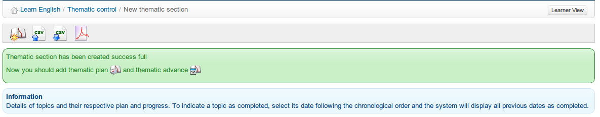

# Create a thematic section

The thematic sections represent the highest level in the course progress' structure. You need to create sections in order to be able to create other levels of the structure.

To create the first section, create the _New thematic section_ icon  and complete the relevant fields using text, images etc.

_Illustration 137: Course progress – invitation to create a thematic plan_

On clicking _Save_ you will be invited to create new thematic plan:

_Illustration 138: Course progress – invitation to create a thematic plan/advance_

