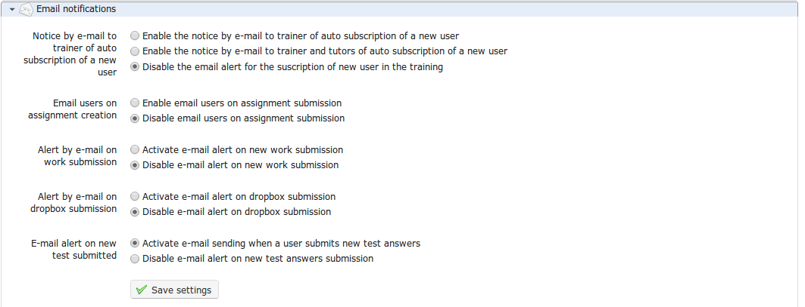

# E-Mail-Benachrichtigungen

E-Mail-Benachrichtigungen  sind ein effektiver Weg, um sicherzustellen, dass der Lehrer durch sofortige Warnungen über wichtige Ereignisse in seinem Kurs informiert ist, sobald sie eintreten. Die verschiedenen Einstellungen sind Stutfohlen im Abschnitt beschrieben:

_Illustration 174: Kurseinstellungen — E-Mail-Benachrichtigungen_

In diesem Abschnitt können Sie wählen, ob Sie eine E-Mail-Benachrichtigung erhalten möchten, wenn:

* ein Benutzer hat Ihren Kurs abonniert \(diese Funktion muss vom Plattformadministrator aktiviert werden\),
* Eine neue Datei wird in den _Assignments_ oder den _Dropbox_-Tools eingereicht,
* Ein Test wird von einem Lernenden bestanden.

Es ist auch möglich, eine E-Mail-Benachrichtigung für alle Benutzer festzulegen, wenn eine neue Zuweisung erstellt wird.