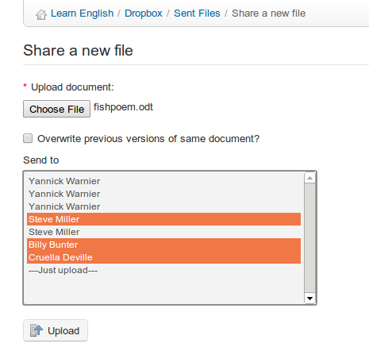

# Senden Sie eine Datei an bestimmte Benutzer

* klicken Sie auf das Symbol „Eine neue Datei teilen“ 
* klicken Sie auf die Schaltfläche _choose file_ und wählen Sie die Datei auf Ihrem Computer aus,
* entscheiden Sie, ob andere Dateien mit dem gleichen Namen überschrieben werden sollen
* Wählen Sie in der Liste _An senden die Personen aus, für die das Dokument freigegeben werden soll \(Gruppen können auch ausgewählt werden, indem Sie die STRG-Taste gedrückt halten, während Sie auf die Namen klicken\)
* klicken Sie auf die Schaltfläche _Upload.

_Illustration 146: Dropbox — Eine Datei_

Dateien werden auf der Registerkarte “sent files” aufgelistet, wenn sie vom Benutzer hochgeladen wurden, und unter der Registerkarte “received file”, wenn die Datei von jemand anderem hochgeladen wurde, können alle Dateien sofort vom Empfänger und vom Absender aufgerufen werden.