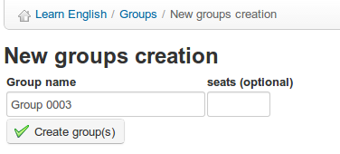

# Erstelle eine Gruppe

Klicken Sie auf der Hauptseite _Groups_ auf das Symbol _Neue Gruppe erstellen \(s\) _ . Sie werden aufgefordert, die Anzahl der zu erstellenden Gruppen einzugeben \(dies beschleunigt den Prozess, wenn Sie mehr als eine Gruppe erstellen möchten\) und auf die Schaltfläche _Weiter klicken, um Gruppe \(s\_) zu erstellen:

_Illustration 148: Erstelle eine Gruppen_

Geben Sie ihm einen Namen, geben Sie die Anzahl der leeren Plätze ein, die Sie in der Gruppe haben möchten, und klicken Sie auf _Gruppe erstellen \(s\) _. Die neue Gruppe wird in den Angeboten auf der Hauptseite von _Groups_ angezeigt. Es kann mit dem üblichen _Delete_ Icon  gelöscht werden.