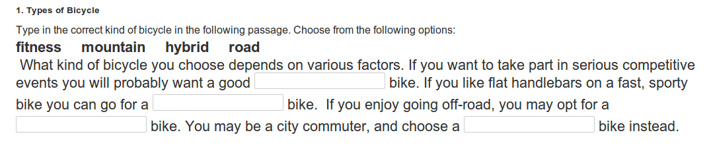
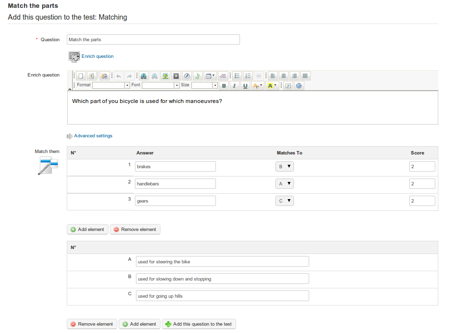
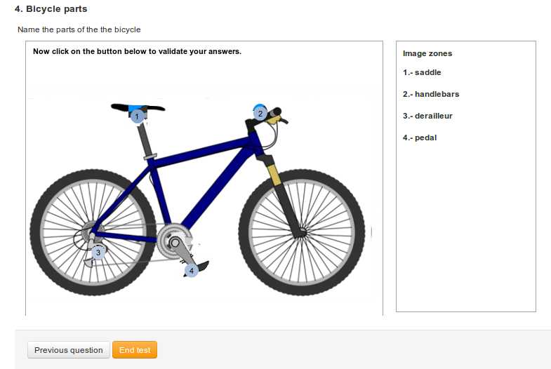
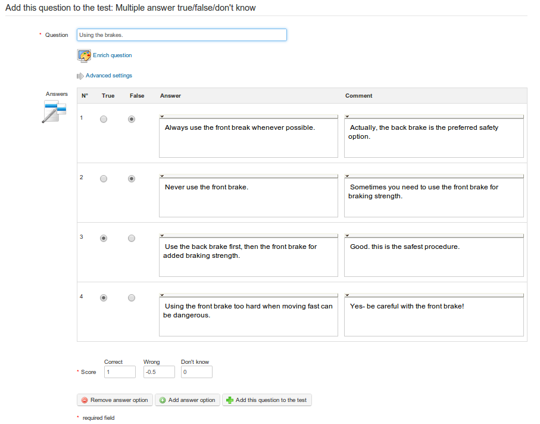

# Fragen zum Test hinzufügen

Wenn Sie einen Test erstellen, klicken Sie auf _Weiter zu den Fragen_ Sie werden zur Seite mit Fragen weitergeleitet:

_Illustration 47: Erste Ansicht der Fragenliste_

Neben der Symbolleiste zeigt die Seite ein Array verschiedener Fragetypen an. \(Auf dieselbe Seite kann zu einem späteren Zeitpunkt zugegriffen werden, indem das Bearbeitungssymbol für einen bestimmten Test verwendet wird, der auf der Seite _Tests_ aufgeführt ist.\) Sie bietet eine Reihe von Fragetypen, aus denen Sie auswählen können, die in diesem Abschnitt beschrieben werden. Jeder Test kann eine Kombination von Fragetypen enthalten - dies kann sich als nützlich erweisen, um sicherzustellen, dass Tests nicht monoton werden.

Banken/Formular ausfüllen

mehrfache Auswahl

Frage öffnen

Bild-Zonen

Eindeutige Antwort + unbekannt

Kombination T/F/?

mehrfache Antwort

übereinstimmende

Mündlicher Ausdruck

exakte Auswahl

Mehrfache Antwort T/F/?

Globale mehrfache Antwort

_Illustration 48: Übungen — Fragetypen_

Fragen werden mit einem Online-Formular erstellt, das je nach Fragetyp unterschiedlich ist. In den folgenden Unterabschnitten wird jedes Formular detailliert beschrieben. Die Fertigstellung der Formulare ist ziemlich intuitiv. Die folgenden allgemeinen Punkte zum Ausfüllen der Online-Formulare gelten für alle oder die meisten Arten von Fragen:

1. Die Spalte “Comment” wird nur angezeigt, wenn Sie die Option _show Feedback\_to in den\_advanced Einstellungen_ ausgewählt haben, als Sie den Test erstellt haben \(wenn Sie kein Feedback anzeigen möchten, hat es wenig Sinn, diese Spalte auf der Seite anzuzeigen.\
2. Alle mit einem roten Sternchen gekennzeichneten Felder\* müssen ausgefüllt werden.
3. Jede Frage hat einen Titel und eine “enriched” -Beschreibung. Wir empfehlen generell, einen kurzen Titel in das Titelfeld zu geben und die Frage **echte** in das Feld _enrich question_ zu setzen. Auf diese Weise können Sie eine viel umfassendere, bedeutendere Frage stellen, Bilder verwenden und/oder Audio oder Video einbeziehen.
4. Alle Antwort- und Kommentarfelder verfügen über Bearbeitungstools, die standardmäßig ausgeblendet sind, aber durch Klicken auf den kleinen schwarzen Pfeil in der oberen linken Ecke des Textfelds angezeigt werden können. Auf diese Weise können Sie Ihren Antworten oder Feedbackkommentaren auch Bilder, Links und Audio hinzufügen.
5. Jeder Fragetyp beinhaltet die **Zuweisung von Scores**. Bei Fragen, die später von einem Lehrer bewertet werden müssen, ist dies einfach eine Höchstpunktzahl, gegen die der Lehrer den Test markieren wird. Im Falle objektiver Tests, bei denen die Teilnehmer eine Antwort auswählen, kann die Punktzahl für jede gewählte richtige oder falsche Antwort festgelegt werden und negative Werte enthalten. Die Lehrer sollten sich Gedanken machen, insbesondere bei Tests mit unterschiedlichen Fragetypen, über die Gewichtung innerhalb des Gesamttests, die jede Frage tragen sollte.
6. Die Lehrer sollten auch die Anzahl der Optionen berücksichtigen, die sie bei Fragen mit mehreren Auswahltypen anbieten möchten. Dies kann mithilfe der roten und grünen Tasten _remove/add_ _answer am Fuße des Formulars bestimmt werden.
7. Wenn Sie viele Fragen zu mehreren Themen haben, können Sie es aus organisatorischen Gründen nützlich finden, einzelne Fragen in den _erweiterten Optionen_ Kategorien zuzuweisen - insbesondere wenn Sie Fragen recyceln möchten. \(Sie müssen die Kategorien natürlich zuerst erstellen und auf der Haupttestseite die Option _create category_ wählen . Dies ermöglicht es, eine **Kategorie** mit einer Beschreibung zu erstellen, die in einer Dropdown-Liste angezeigt wird.\) Die Verwendung von Kategorien ist optional, aber wir empfehlen Ihnen dringend, dies zu tun, wenn Sie eine Reihe von Fragen haben, um Fragen in Zukunft zu bearbeiten oder zu recyceln.
8. Sie können auch ein Schwierigkeitsstufen** für jede Frage in den _advanced -Optionen zuweisen._ Dies kann nützlich sein, um die Bewertung der Arbeit der Schüler später zu optimieren oder den Test insgesamt zu überprüfen. Es kann auch sehr nützlich sein, wenn es um Recyclingfragen geht, damit Sie Fragen nach Schwierigkeitsgraden filtern können.

## Typ 1: Multiple Choice — Einzelne Antwort 

The classic Multiple-Choice-Frage ist eine, bei der **nur eine Antwort** für Bewertungszwecke als gültig angesehen werden kann. Es ist möglich, den Test etwas schwieriger zu machen, indem man einer falschen Antwort eine negative Punktzahl zuweist. Wenn dies hervorgehoben wird \(z.B. in der Testeinführung oder der Frage selbst\) ermutigt dies den Lernenden, sorgfältiger zu überlegen, bevor er eine Antwort zufällig auswählt und eine Strafe verhängt.

_Illustration 49: Tests — Multiple-Choice, Single-Antwort_

## Typ 2: Multiple Choice — Mehrfachantwort 

Der Fragentyp This ist eine Variante der vorherigen einfachen Multiple-Choice-Frage. Damit können Sie mehr als eine gültige Antwort zuweisen. Auch hier sind positive und negative Scores möglich. Diese Art von Frage kann sich für Schüler als schwieriger erweisen \(vielleicht möchten Sie in der Frage angeben, dass es zwei Antworten gibt - also nicht auf “trick” sie!

Abbildung 50: Tests — Frage zu mehreren Antworten

## Typ 3: Fülle die Lücken 

Der Fragentyp This kann verwendet werden, um die klassische “cloze passage” -Übung zu erstellen, die von Sprachlehrern bevorzugt wird, in der bestimmte Wörter in einer schriftlichen Passage ausgewählt werden können, um als leeres Feld angezeigt zu werden, das die Schüler ausfüllen können. Zuerst muss der Lehrer einfach die Passage \(oder eine Liste von Sätzen\) eingeben und dann eckige Klammern um die Wörter hinzufügen, die “blanked” sein sollen. \(Diese Wörter werden dem Lernenden als leere Textfelder angezeigt, die als richtig markiert werden, wenn der Schüler die richtige Antwort erhält, die mit dem vom Lehrer eingegebenen Wort übereinstimmt.\) Sobald die eckigen Klammern hinzugefügt werden, wird im Formular ein “score” -Feld für jedes zu korrigierende Wort angezeigt. Um den Test ein wenig zu vereinfachen, kann der Lehrer die auszuwählenden Wörter im Feld “enrich question” auflisten. Es ist ein praktischer Test zur Überprüfung der wichtigsten Terminologie oder des Vokabulars.

_Illustration 51: Tests - Füllt die Leeren_

Die Frage wird dem Lernenden so erscheinen, der einfach das richtige Wort in die leeren Felder eingeben muss:

## Typ 4: Passend 

Die Art der Frage This ist so konzipiert, dass der Lernende Textelemente aus einer Liste mit Textelementen in einer anderen verknüpfen kann. Ein Element könnte ein Wort, ein Satz oder ein Teilsatz sein. Es kann auch verwendet werden, um einen Benutzer aufzufordern, Elemente in einer bestimmten Reihenfolge zu sortieren.

_Illustration 52: Tests — Passende Textelemente_

Der Lernende wird die passende Frage wie folgt ansehen:

oder ab 1.9.6 wird ein ziehbarer Kreis es für Studenten etwas attraktiver machen.

## Typ 5: Frage öffnen 

The offener Fragentyp ermöglicht es dem Teilnehmer, als Antwort zu schreiben, was er möchte \(eine Art „Mini-Zuweisung\). Da eine solche Aktivität keine einzige Antwort hat, wird sie am Ende des Tests nicht automatisch ausgewertet, muss aber vom Lehrer manuell ausgewertet werden, bevor das endgültige Testergebnis erzielt werden kann. Wie bei der Aufgabe und den markierten Forenbeiträgen kann der Lehrer dies über das Tool _Recording_ tun, das offene Fragen kennzeichnet, die markiert werden müssen.

_Illustration 53: Tests - Offene Fragen_

Dem Lernenden wird ein Textfeld zum Schreiben präsentiert. \(Er kann den kleinen Pfeil links am oberen Rand des Feldes verwenden, um eine Reihe von Feldern zu verwenden, wenn er seine Präsentation bereichern möchte. z.B. mit Überschrift oder hervorgehobenem Text.\)

## Typ 6: Audio-Antwort 

This neuer Fragetyp, der mit Chamilo 1.9 verfügbar ist, wird nur angezeigt, wenn Ihr Administrator die Audio-Aufnahmefunktion von Nanogong aktiviert hat. Die Frage kann mit dem oben beschriebenen Typ “open question” verglichen werden, der eine manuelle Markierung durch den Lehrer erfordert. Anstatt den Lernenden jedoch zu bitten, eine Textstelle zu schreiben, bitten Sie ihn, eine Audioantwort aufzunehmen. Dies hat offensichtliche Verwendungszwecke für Sprachkurse für Lernende mit besonderem Zugangsbedarf, kann jedoch in vielen Studienbereichen eine nützliche Alternative bieten - die Lernenden zu ermutigen, ihre mündlichen Präsentationsfähigkeiten zu entwickeln.

\(Hinweis: Für diesen Fragetyp muss der Teilnehmer Java-Applets in seinem Browser unterstützen. Ist dies nicht der Fall, muss er das Audio separat aufnehmen und dann als MP3-Datei auf den Server hochladen.\)

Wegen des zusätzlichen Erfordersnts für diesen Fragentyp sollten Sie sicherstellen, dass Ihre Lernenden wissen, dass der Test eine Audiofrage enthält und dass sie mehr als eine Chance haben, den Test auszuprobieren, um zu überprüfen, ob ihr Browser dies unterstützt oder nicht. \(Bedenken Sie, dass die Durchführung eines Tests im Allgemeinen eine stressige Erfahrung ist. Du willst deinen Lernenden keinen Nervenzusammenbruch geben, weil sie es nicht schaffen, eine Audioantwort aufzunehmen!\)

_Illustration 54: Tests — mündlicher Ausdruck_

Der Lernende muss lediglich die _Record-Antwort_ drücken, wenn er bereit ist zu sprechen, und den Anweisungen für den Nanogong-Recorder auf dem Bildschirm folgen, der seine Aufnahme automatisch an den Lehrer zum Markieren und Scoring sendet.

## Typ 7: Hotspot oder Bildbereich 

In Bei dieser Art von Frage wird der Lernende gebeten, Bereiche innerhalb eines Bildes zu identifizieren, indem er darauf klickt. Diese Bereiche wurden zuvor vom Lehrer definiert. Der Aufbau einer dieser Fragen erfordert etwas mehr Arbeit als andere Arten.

_Illustration 55: Übungen - Hot Spot Fragen zur Erstellung_

Nachdem Sie Ihr Bild hochgeladen und Ihre Frage benannt haben, können Sie Hotspots hinzufügen oder entfernen und den Bereich mithilfe einer Ellipse, eines Rechtecks oder einer Polygonform definieren. Wie bei anderen Fragetypen können Sie Kommentare zu Feedbackzwecken hinzufügen und eine Bewertung für jeden korrekt identifizierten Bereich bestimmen.

Der Teilnehmer muss auf das Bild klicken, um die aufgelisteten Bereiche zu identifizieren — die Zahlen werden über den Bereichen angezeigt, auf die er klickt:

_Illustration 56: Übungen - Hot-Spot-Lerneransicht_

## Typ 8: Genaue Kombination 

This ist eine Variante des oben angezeigten Tests mit mehreren Antworten. Der einzige Unterschied besteht darin, dass keine teilweise korrekte Kombination akzeptiert wird. Das heißt, wenn zwischen den Optionen A-B-C-D nur B und D korrekt sind, müssen Sie sowohl B**und** D markieren, um die Punkte zu erhalten, die dieser Frage zugewiesen sind. Es wird daher nur ein Gesamtpunktefeld auf dem Formular angezeigt.

_Illustration 57: Tests - Exakte Kombination_

## Typ 9: Eindeutige Antwort mit unbekannt 

Sometimes Ein Lehrer möchte, dass der Schüler angibt, dass er die Antwort auf eine Frage nicht kennt, anstatt nur eine Antwort zu erraten. Dieser Fragentyp ist eine Multiple-Choice-Frage mit einer Antwort, behält sich jedoch die letzte Antwort als “Don't know” -Option mit einer automatischen Punktzahl von Null vor. Die Schüler können vom Raten abgehalten werden, indem sie eine falsche Antwort mit einer negativen Punktzahl bestrafen.

_Illustration 58: Tests — einzigartige Antwort mit Unbekannt_

## Typ 10: Mehrfache Antwort Richtig/Falsch/Weiß nicht 

This ist ein weiteres Kombinationsformat, das eine NULLpunktzahl wie bei der obigen Fragenoption enthält, jedoch mit wahren/falschen Antworten statt einer Mehrfachauswahl. “don't know” Auch hier können negative Bewertungen zugewiesen werden, um das Raten zu verhindern, und “honest” Ignoranz zugeben!

_Illustration 59: Tests — Mehrfache Antwort wahr/falsch/weiss nicht_

## Typ 11: Kombination true/false/weiß nicht 

Die This -Option bietet eine einzelne Bewertung für eine oder mehrere Fragen. Das Formular ähnelt dem “exact answer” -Formular, aber der Test wird dem Schüler anders angezeigt, wie unten dargestellt.

_Illustration 60: Tests — Kombination wahr/falsch/weiss nicht_

Der Lernende wird die Frage \(s\) anzeigen und die Optionsschaltflächen wie folgt verwenden:

> **Hinweis**: Ein “don't know” generiert eine Nullpunktzahl, daher kann dieses Format am besten eine oder zwei Fragen enthalten - was eine umsichtige Verwendung des Lehrers erfordert.

## Typ 12: Globale mehrfache Antwort 

Das This -Fragenformat kombiniert das Format für mehrere Antworten mit einem einzigen Ergebnis und bietet eine Option, um sicherzustellen, dass kein negativer Wert anfällt

_Illustration 61: Tests — Globale Mehrfachantwort_