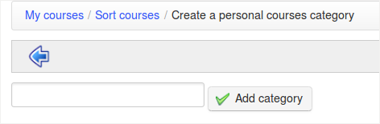

# Personal categories

Go to _My courses_, option _Sort courses_ in the menu, to get to the courses sorting tools page. Click on the _Create a personal course category_, and fill the name of the new personal category to be created. Finally, click the _Add category_ icon.

Illustration 19: Sort my courses

_Illustration 20: Personal category creation form_

The new personal category appears in a list at the top of the page. It is possible to create several personal course categories.

_Illustration 21: Personal courses category created_

Click the pencil icon next to each course to set a category for it. In the drop-down list, select the personal category with which the course will be associated, then click the confirmation button. With courses sorted and linked to personal categories, the courses homepage is more readable. Courses not associated with any personal category are shown at the top of the page.

_Illustration 22: Personal courses categories_

To remove a category, click the red crossand confirm.

