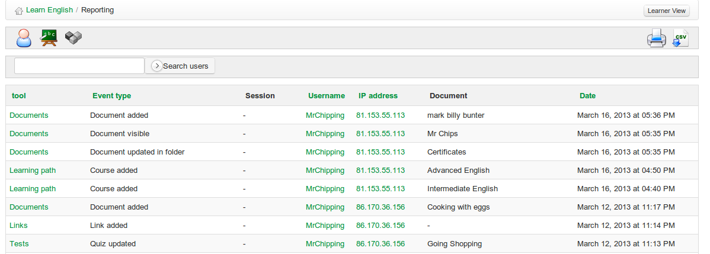

# Reporting Ressourcen

Um auf Details der im Kurs verwendeten Ressourcen zuzugreifen, klicken Sie auf der Hauptseite Berichterstattung auf das\_Icon auf Ressource\__icon.  Dadurch wird eine Liste der Ressourcen angezeigt, die dem Kurs hinzugefügt und gelöscht wurden, einschließlich

Ressourcen, die von Studenten hinzugefügt wurden.

_Illustration 90: Bericht über resource_

Eine Suchfunktion ermöglicht es Lehrern, die Ressourcen zu filtern und zu finden, an denen sie interessiert sind, und die Links auf der linken Seite ermöglichen es ihm, einfach zu der Ressource zu navigieren. Es gibt auch Links zum Benutzerprofil für den Benutzer, der jeden Link hinzufügt, und sogar eine IP-Adresse, mit der der Standort der Benutzer angegeben werden kann.