# Test/exam Reporting

The exam tracking tool is useful for teachers wanting to focus on monitoring learners' performance in tests. 
By clicking on the _exam tracking_ icon  on the main reporting page, 
the teacher is provided with a list of tests and students' scores/percentages, including number of attempts. 
They can select individual tests and filter results by a given percentage e.g. to display a list of students 
passing a course, or excelling in their score. This data can be exported as a standard MS-Excel file®.

_Illustration: Exam tracking_

## Inside the _Tests_ tool

Inside the _Tests_ tool itself, the teacher will also find a large amount of reporting options.

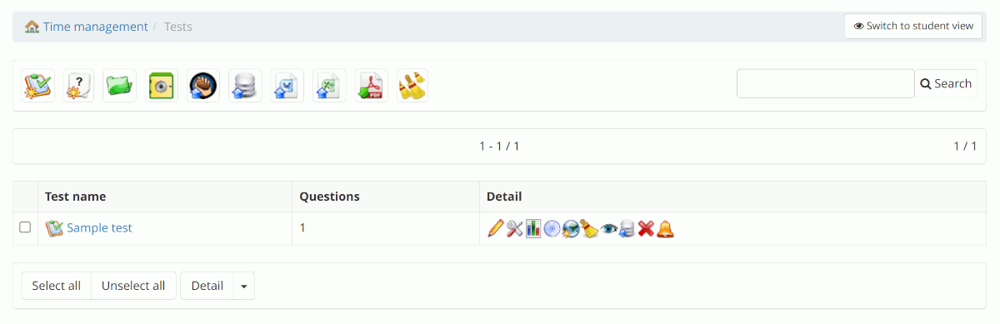_Illustration: Tests list_

Note that the broom(s) icons are meant to *delete all previous user results* from the database, so do not use them 
without thinking thoroughly about the impact they might have on your tracking. 

### Export all results as individual PDFs

In the actions bar on top, a PDF icon  called "Export all results of all 
tests" allows the teacher (since version 1.11.20) to download a zip file containing one zip for each test. Inside 
this last zip file, each test attempt by any student is represented by a different PDF file bearing the name of 
the user and the unique internal ID of the attempt.

Note the zips themselves are named based on internal IDs of the session (S) (if any), the course (C) and the test (T).
While these IDs are not readily visible in Chamilo, you can usually find them in the URL or hovering over an icon.

Although not covered completely in this manual, the same kind of report can be generated, with the addition of a date 
filter, from the administration page, "Course sessions" block, "Export all results from an exercise" link.

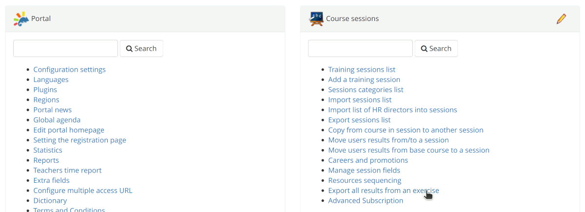_Illustration: Link to PDF export of all results_

On this page, you can filter by session, course, test and start/end dates.

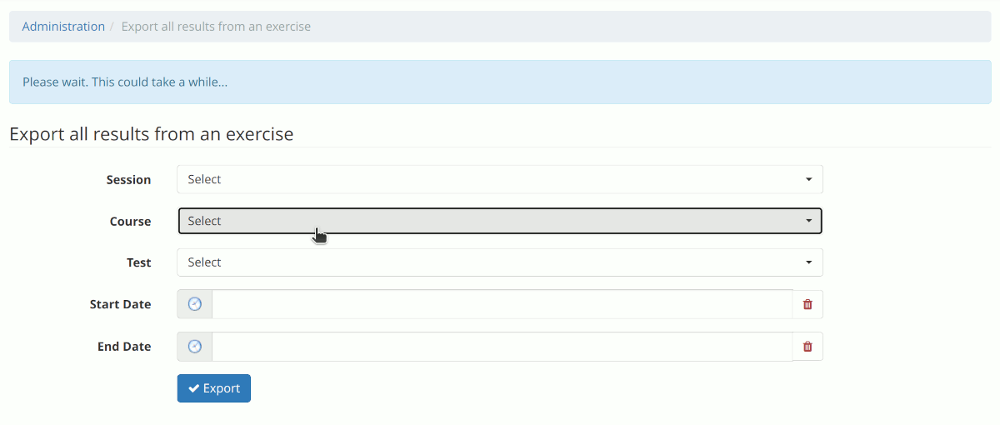_Illustration: PDF export page for all tests_

This latter feature is only available to administrators as it spans all sessions, courses and tests.

## Within a test

By clicking the charts icon  next to one specific test, you will get access 
to a large set of reports on that specific test.

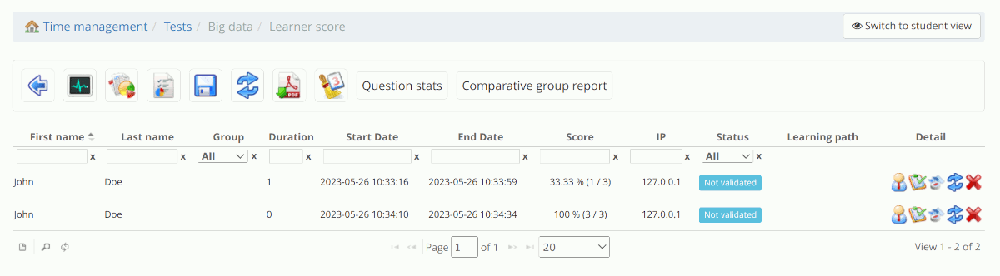_Illustration: Test reports page_

On this page, everything has to do with reporting, so let's dive into more details.

### Live results

The _Live results_ icon  allows you to access a "live" view of students 
taking the exam.

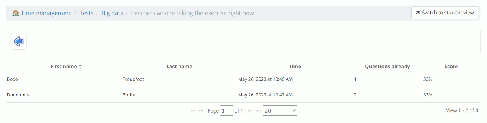_Illustration: Test report "live"_

On this screen, you can see that 2 users are currently taking a 3-questions test. One of them started at 10:46 AM, the 
second one at 10:47 AM.

The first user only answered 1 question so far (column _Questions already answered_ only showing partially in this 
screenshot), while the second user already answered 2 questions.

However, their score is the same, meaning the second user has made a mistake already (otherwise, given the test 
contains 3 questions and (s)he already answered 2 of them (s)he would have obtained 67% progress).

This type of report is particularly practical while watching over a group of students in a common room, as you can
then intervene and check if everything is alright *before the end of the test*.

For example, getting all answers correct very quickly might mean the user is using some cheating technique.

On the opposite spectrum, if users take a long time and answer most questions incorrectly, they might have some
technical issue or mental stress that you might be able to help with. 

### Report by question

The second icon, a standard pie chart icon, brings you to a report page all about questions.

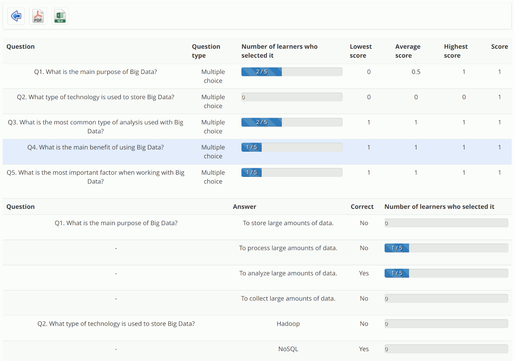_Illustration: Test report by question_

The table is divided into two different sections.

The first one is a synthesis of each question:
- Question title.
- Question type.
- Number of learners who "selected" it, meaning the number of users who had this question appear in their test. It's important to note that, in tests with questions picked at random in a questions bank, not all users will see all questions.
- Lowest score: the lowest score obtained on that question. This is *usually* 0, except if no-one got it completely wrong.
- Average score: the sum of scores on that question, divided by the number of times it appeared to a student.
- Highest score: the highest score for that question. If a question does not have the top score there at all, it means that *no-one* got it 100% right, so it would look like the question itself might be a bit too difficult or out of context. A good hint for teachers.
- Score: this is the highest possible score for that question (to be compared with the _Highest score_ column).

The second part of the table focuses more on the possible answers, and tries to provide some insight into how well 
these possible answers have been prepared:
- Question title.
- Answer: each of the possible answers.
- Correct: whether that specific answer is considered correct for the question.
- Number of users who selected it: the number of users who selected *that* specific answer when answering the question.

If a question has well-designed "possible answers" and you have a normal set of learners, it is likely that each answer 
would be selected at a reasonable frequency. If an answer is never selected, then either:
- all of your learners are amazingly good at this
- that answer is too obviously wrong
- your data set is not large enough to make this analysis relevant (only a few learners or so)

Note you can export this report using the icons in the action bar.

### Report by attempt

The _Report by attempts_ icon brings you to a page focused on counting attempts, essentially.

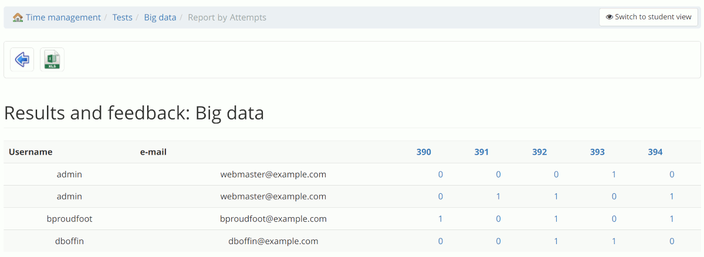_Illustration: Test report by attempt_

The table shows the following information:
- Username
- E-mail
- One column for each question (hovering the ID will show you the question title), giving you the number of times each question appeared during the attempt (0 or 1 time)

By clicking the cells with something different than 0, you open a modal window showing you the answer of that specific
user to that specific question.

_Illustration: Detail of question attempt_

Note you can export this report in .xlsx format.

### Export un-detailed results

The _Export_ icon  simply 
allows you to export a CSV or XLS version of the report you see on screen.

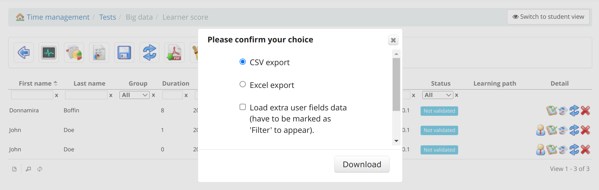_Illustration: Export results options_

An option allows you to include user profile fields (if they have been defined by the administrator and marked as
available for filtering) in the export.

### Recalculate results

This is not a report per se, but the double arrow, _Recalculate results_, icon 
allows the teacher to recalculate all scores for this test.

Recalculating scores can be useful if you have modified a question in a way that fixes an issue but can have an impact
on previous users' scores to the test.

For example, let's say you had a unique-answer question and, while designing the question, you made a mistake and
marked answer 2 as correct whereas it should have been answer 3.

Learners who (erroneously) marked answer 2 would have gotten a score for a correct answer (+1, for example) while they
should have gotten 0 or -1. Similarly, learners who marked the correct answer 3 would have had a score of 0 or -1 to
that question.

One learner reports that this question was incorrectly scored (or maybe you noticed it yourself), so you decide to fix
the question by changing the correct answer and the corresponding score.

Now your question is fixed, but the scores of learners who took the test previously are still considering that answer 2
was the correct one.

To fix this, simply click the _Recalculate results_, either in the action bar (applying to all attempts) or next to one
specific attempt to only affect that one. Chamilo will then recalculate the scores based on the answers selected by the
learners, but taking into account the correct score.

Of course, this might lead to confusion within your group of learners, so make sure you communicate correctly around 
this change. You can do so through the "Announcement" tool of the course.

### Export all results from an exercise

Similarly to the _Export all results as individual PDFs_ section at the beginning of this page, 
the  icon report will export all attempts and their detailed results 
page to PDF. However, it only does so for this specific test.

Given the fact it generates several PDFs at once, it will package them in one single zip file. 

### Clean all results before a selected date

The _Clean all results before a selected date_ icon 
is one of those dangerous icons that will delete attempts from the database.

In this case, a calendar allows you to pick the date after which attempts will *not* be deleted.

This option is often used in the absence of sessions management, where the same course is used over and over again
across calendar years, so you want to clean up what other learners did before, so you have a clean sheet to work with.

However, we strongly recommend using sessions and keeping reporting data untouched.

### Questions stats report

The _Question stats_ button leads you to a table putting in evidence the number and rate of wrong answers to each
question. Similarly to the _Report by question_ we saw a few sections back, this report helps you identify the
questions that have the highest probability of being improved by reformulating, as it is not "normal" that most
learners would fail it.

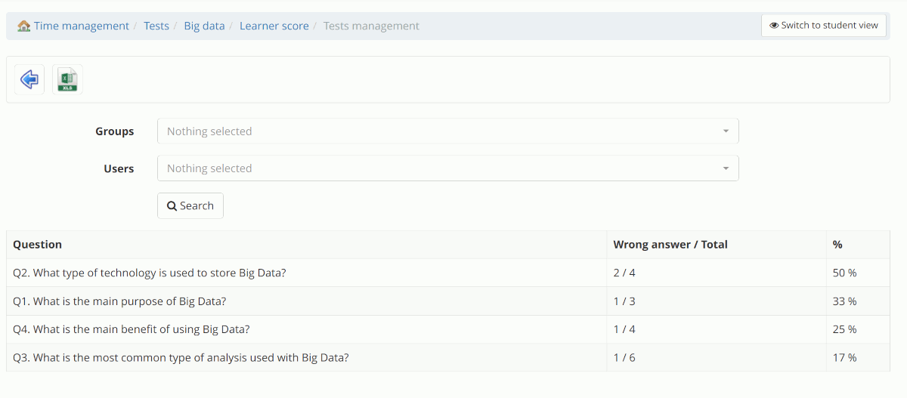_Illustration: Questions statistics report_

Note you can export this report in XLS format, and you can filter the results by group or by user.

### Comparative group report

The _Comparative group report_ button leads you to a page that allows you to compare the relative performance between
user groups (as defined in the _Groups_ tool of the same course).

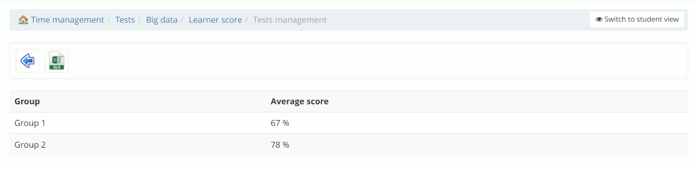_Illustration: Comparative group report_

The report is very short and shows the average score for each group.

Note that this report is based on an average of *all attempts* by users. If a user has 3 attempts, then the average 
will include those 3 attempts.

You can export this report in XLS format.

## Within an attempt

Finally, on the main results page, you already have relevant and important data...

The page is paginated, which means you can have as many results there and you can choose the number of results 
shown per page.

Most columns are sortable and searchable, so if you have a lot of data there, you can quickly filter by users' 
lastnames, for example.

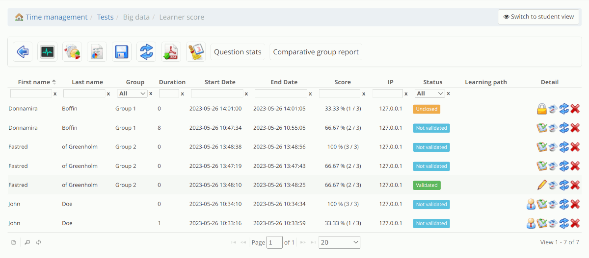_Illustration: Test reports page, more results_

Let's review the available columns:
- First name.
- Last name.
- Group: the user group to which this user belongs, in the course (this is *not* the global class).
- Duration: in minutes, the amount of time the user took to finish this attempt. Note that while the test is unfinished, this number remains set to 0. To see a "live" attempt, check the _Live results_ report.
- Start Date: the date and time the user started the test (expressed in your timezone if you have set one, otherwise the system time).
- End Date: the end date. If the test is unfinished, this is the time of the last interaction (saving an answer, for example).
- Score: the user's score for this attempt. The format of that information can be reconfigured at the global level. By default, it shows the percentage and the absolute score on top of the maximum achievable score for this test.
- IP: if not disabled by the admin, the system registers the IP address of the user (IPv4 or IPv6) and shows it to teachers, in an attempt to ease identification of fraudulent simultaneous attempts by the same user from 2 different IP addresses. 
- Status: an indicator of the current state of the test. Can be "Unclosed" if still unfinished, "Not validated" if finished but the teacher did not yet validate the test results manually, and "Validated" when (s)he did.
- Learning path: in case this test is used in a learning path, the name of the learning path will be shown in this column for informative purposes.
- Detail: a series of actions that can be executed on the attempt, or basic information:
  - Teacher icon: identifies if the user who took this test was a learner or a teacher (usually, results from teachers can be ignored, but we still include them where we feel it would confuse teachers not to include them).
  - Lock icon: whenever a test is in the "Unclosed" state, teachers can force the closure of the test, in which case it changes to "Not validated".
  - Test icon ("Grade activity"): allows the teacher to move to the detailed report of attempt for this attempt and give feedback or set scores in the case of open-type questions.
  - Pencil icon ("Edit"): only appears if the test was already validated before, to allow for another layer of validation.
  - Compass icon (IP address appears on hover): check where in the world the IP address that was registered is located (approximately).
  - Cross icon ("Delete") to delete the attempt (which will allow the user to take the test again, except if it was limited in dates of availability).

### Test attempt detail

When clicking that test or pencil icon in the "Detail" column of any attempt, the teacher is sent to the same kind of
page as the user itself will see upon finishing the test if some feedback or results are set to be shown.

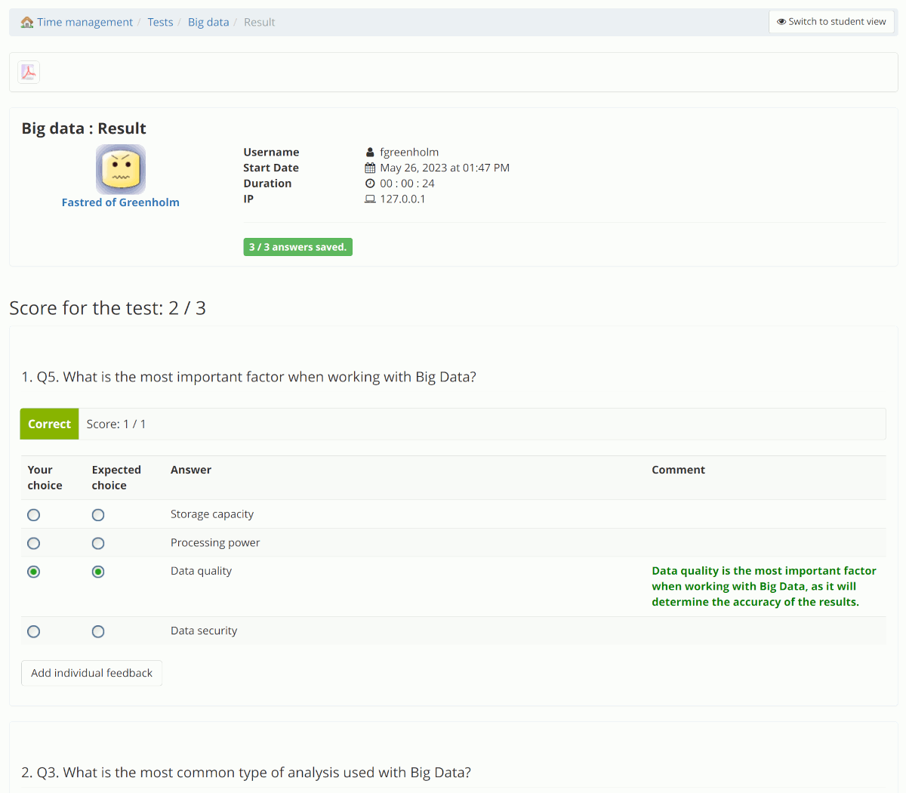_Illustration: Test attempt detail_

Except the teacher can provide feedback (if the question is auto-evaluated) or feedback *and* a score if the question
is of "open" type.

At the end of the page, a checkbox allows the teacher to decide whether the feedback provided should be sent by e-mail
to the user or not.

If the test was not entirely auto-evaluated, the manual evaluation is a necessary process. We recommend to teachers to
do that quickly, as users love rapid feedback.

Obviously, the ideal solution in terms of immediate feedback is still
not to include any question that requires manual evaluation.

This detail page can also be exported to PDF.