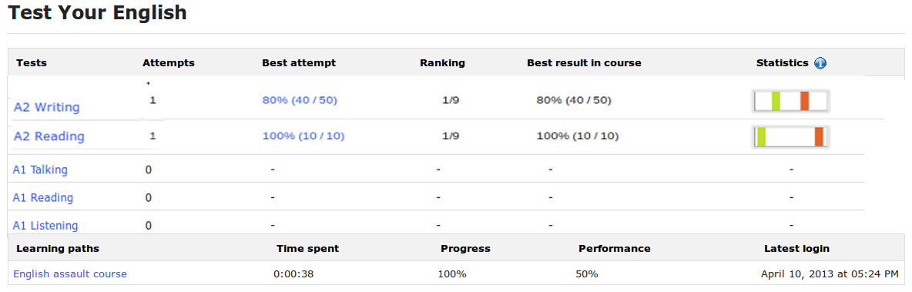

# Mein Statistik-Reiter

Die Registerkarte _Meine Statistiken_ bietet Lehrern und Lernenden eine Reihe innovativer Funktionen, sofern Veröffentlichungstermine für Übungen festgelegt wurden. Die Lernenden können dann im Vergleich zu denen anderer Lernende ein visuelles Ergebnis ihrer Punktzahlen sehen.

_Illustration 199: Sitzungen — Registerkarte „Meine Statistiken“

Wenn Sie auf den doppelten blauen Pfeil für einen beliebigen Kurs klicken, können Sie eine Reihe detaillierterer Ergebnisinformationen anzeigen:

_Illustration 200: Sessions — Statistische Details

Diese Detailansicht zeigt eine grafische Visualisierung der Neupartition der Partituren. Jeder Balken repräsentiert einen Rang der Ergebnisse \(0 -20%, 21 -40%, 41 -60%, 61 -80%, 81 -100%\). Das globale Diagramm stellt die Neuaufteilung der Ergebnisse aller Schüler für diese Übung dar. Der orangefarbene Balken ist der Balken, in dem sich die Ergebnisse des aktuellen Benutzers befinden. Sie können auf das Diagramm klicken, um eine Explosionsansicht zu erhalten.