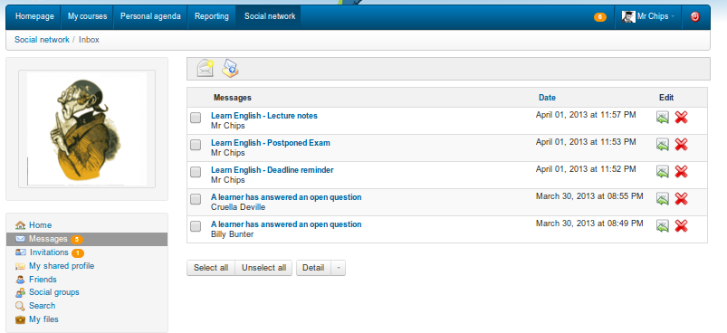

# Interne Nachrichten

Auf der Registerkarte _Social Network_ \(linkes Menü\) können Sie mit dem Eintrag _Messages_ Nachrichten Nachrichten senden oder empfangen. Es ähnelt den meisten Messaging-Tools.

_Illustration 189: Soziales Netzwerk — Interne Nachrichten - Postinbox_

So schreiben Sie eine Nachricht an einen anderen Benutzer \(oder einen Freund\), abonniert die Plattform:

* klicken Sie auf den Link _Messages_ unter Ihrem Bild,
* klicken Sie auf das Symbol „Nachricht verfassen“ ,
* Chamilo vervollständigt das Feld „Senden an“ automatisch mit bekannten Kontakten,
* Geben Sie den Betreff und die Nachricht ein \(optional können Sie eine angehängte Datei hinzufügen\),
* Klicken Sie auf die Schaltfläche _Nachricht senden_.

Wenn der Empfänger seine E-Mail-Adresse in sein Profil eingegeben hat, wird die Nachricht automatisch an seine E-Mail-Adresse gesendet.

> **Hinweis**: Wenn der andere Benutzer dies gewählt hat, wird die Nachricht auch als Benachrichtigung über eine interne Nachricht an seine E-Mail gesendet. Er muss jedoch die Plattform betreten, um Ihnen zu antworten.