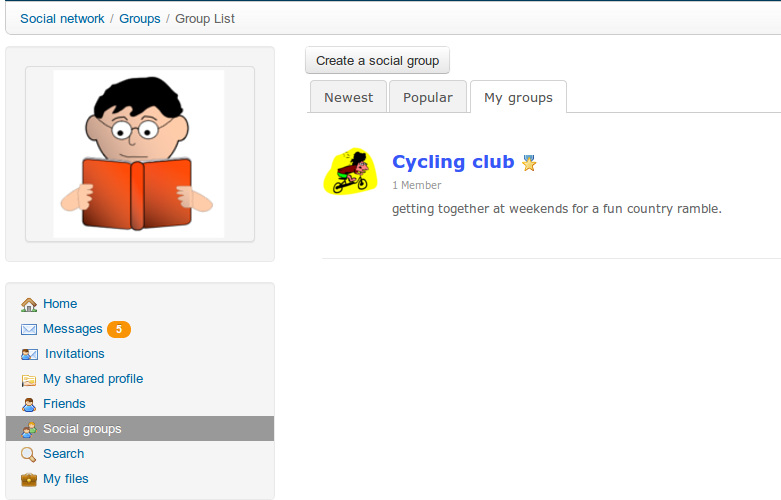
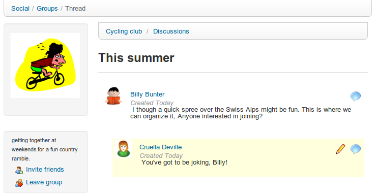

# Soziale Gruppen

Der Link _Social groups_  fasst alle Gruppen zusammen, die auf der Plattform existieren. Diese Gruppen können nur von Administratoren erstellt werden, es sei denn, sie haben diese Option für alle Benutzer aktiviert.

Je nach Zugriff gibt es zwei Arten von Gruppen:

* public \(jeder kann beitreten\)
* privat \(der Gruppenadministrator muss die Mitgliedschaftsanfrage autorisieren\)

_Illustration 192: Soziales Netzwerk — Soziale Gruppen_

Der Tab „Meine Gruppen“ listet die Gruppen auf, bei denen Sie Mitglied sind. Diese Gruppen arbeiten als Forum. Der Administrator \(oder Moderator\) erstellt Diskussionsthemen und Benutzer beginnen mit dem Beitrag.

_Illustration 193: Soziales Netzwerk — Soziale Gruppen interface_