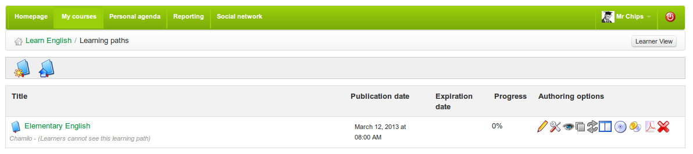

# Einführung

Ein Lernpfad_ in Chamilo ist ein organisatorisches Konzept/Werkzeug, das Aktivitäten oder Lernobjekte aus dem Kurs in einer organisierten Reihenfolge präsentiert, um das Lernen zu leiten und zu unterstützen. Es kann auf verschiedene Arten erstellt werden, die für Kursinhalte geeignet sind. Im einfachsten Fall ist es ein klares Inhaltsverzeichnis oder kann je nach Art der beteiligten Aktivitäten die notwendige Agenda für den Erwerb eines bestimmten Wissens-, Verständnis- oder Fähigkeitsbereichs bereitstellen.

Ein Lernpfad kann auf eine Weise sequenziert werden, die _suggestive_\ ist (einfach abschnittsweise nacheinander wie ein Menü anzeigen\) oder _prescriptive_ \(der Lernende muss den Abschnitten in einer bestimmten Reihenfolge folgen\). Es ist wichtig zu bedenken, dass ein Lernpfad mehr ist als nur dizedlen Kursinhalte: Er stellt eine pädagogische Route dar, die Tests, Diskussionen, Bewertungen, Experimente usw. umfassen könnte.Die Strukturierung eines Pfades, der die Schüler effektiv durch diese Lernerfahrungen führt, ist ein Schlüsselfaktor in gutes Kursdesign.

Klicken Sie auf der Kurs-Homepage auf den Link _Learning path_: 

Mit dem Lernpfad-Tool können Sie entweder einen vorhandenen AICC- oder SCORM-Kurs importieren, einen neuen Lernpfad innerhalb von Chamilo erstellen oder einen bestehenden Lernpfad bearbeiten:

_Illustration 74: Das Lernpfad-Tool: _