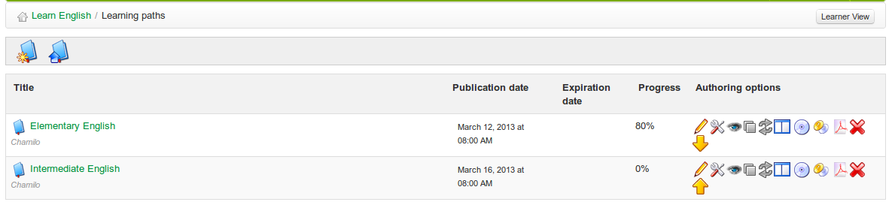

# Lernpfade verwalten

Gehe zu _Meine Kurse_, wähle einen Kurs und klicke auf das Symbol _Learning Path_ :

_Illustration 84: Lernpfade — Liste_

Die rechte Spalte _Authoring-Optionen_ enthält Tools zur Verwaltung Ihrer Lernpfade:

| Icons | Funktionen |
|: —: |: — |
|  | Die Einstellungen des Lernpfads aktualisieren |
|  | Löschen Sie den Lernpfad |
|  | Den Lernpfad bearbeiten |
|   | Den Lernpfad zu/von den Lernenden ein- und ausblenden |
|   | Die Lernseite auf der Kurs-Homepage anzeigen/ausblenden |
|  | Exportiere den Lernpfad im ZIP-Format, um ihn später als SCORM-Inhalt in anderen Tools zu verwenden |
|   | Erlaube/verhindere mehrfache Versuche von Lernenden |
|   | Umschalten zwischen Vollbild- oder Normalansicht \(embedded\) |
|   | Ordne die Lernpfade neu an |
|  | Exportiere den vollständigen Lernpfad als großes mehrseitiges PDF-Dokument |
|  | Lernpfad kopieren |