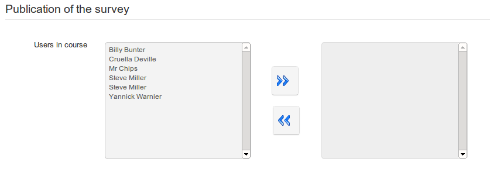

# Veröffentlichung der Umfrage

Wenn Sie mit der Umfrage zufrieden sind, müssen Sie sie nur veröffentlichen \(stellen Sie sicher, dass Sie sich nicht dem Startdatum widersprechen und senden Sie die Einladung per E-Mail für eine Umfrage, die noch nicht verfügbar ist!\)

Klicken Sie auf das Symbol _Publish_ . Wählen Sie die Kursbenutzer aus, an die Sie die Einladung zur Umfrage senden

_Illustration 157: Umfragen — Veröffentlichung: Mitglieder des Kurses auswählen_

Senden Sie zusätzlich oder alternativ Einladungen mit demselben Formular direkt per E-Mail \(separate E-Mail-Adressen mit Semikolons\). Einladungen können an Personen gesendet werden, die keine registrierten Benutzer auf der Plattform sind \(z. B. möchten Sie die Einladung möglicherweise an potenzielle Kunden oder an Eltern von Lernenden senden\):

_Illustration 158: Umfragen — Veröffentlichung: E-Mail an zusätzliche Empfängern_

Wenn Sie die Felder ausgefüllt haben, klicken Sie bitte auf die Schaltfläche _Umfrage veröffentlichen_.

> **Hinweis**: Sie können auch anonyme Personen einladen, ohne eine E-Mail-Adresse zu benötigen \(z. B. Besucher einer Webseite\), indem Sie das Symbol Zugriffslink  in den Umfragelisten verwenden.