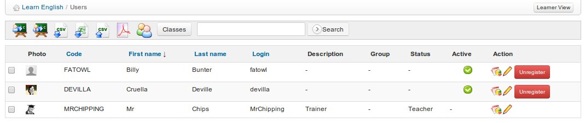

# Nutzer

The _Users_ Tool sammelt alle Lernenden und Lehrer, die den Kurs abonniert haben. Es ermöglicht Ihnen, eine Liste abonnierter Benutzer zu verwalten, neue Lernende zu registrieren und bestimmte Rollen und Verantwortlichkeiten zuzuweisen. Außerdem können Sie die Aktivitäten aller Benutzer, die den Kurs abonniert haben, überwachen.

_Illustration 99: Benutzer — Hauptbildschirm_