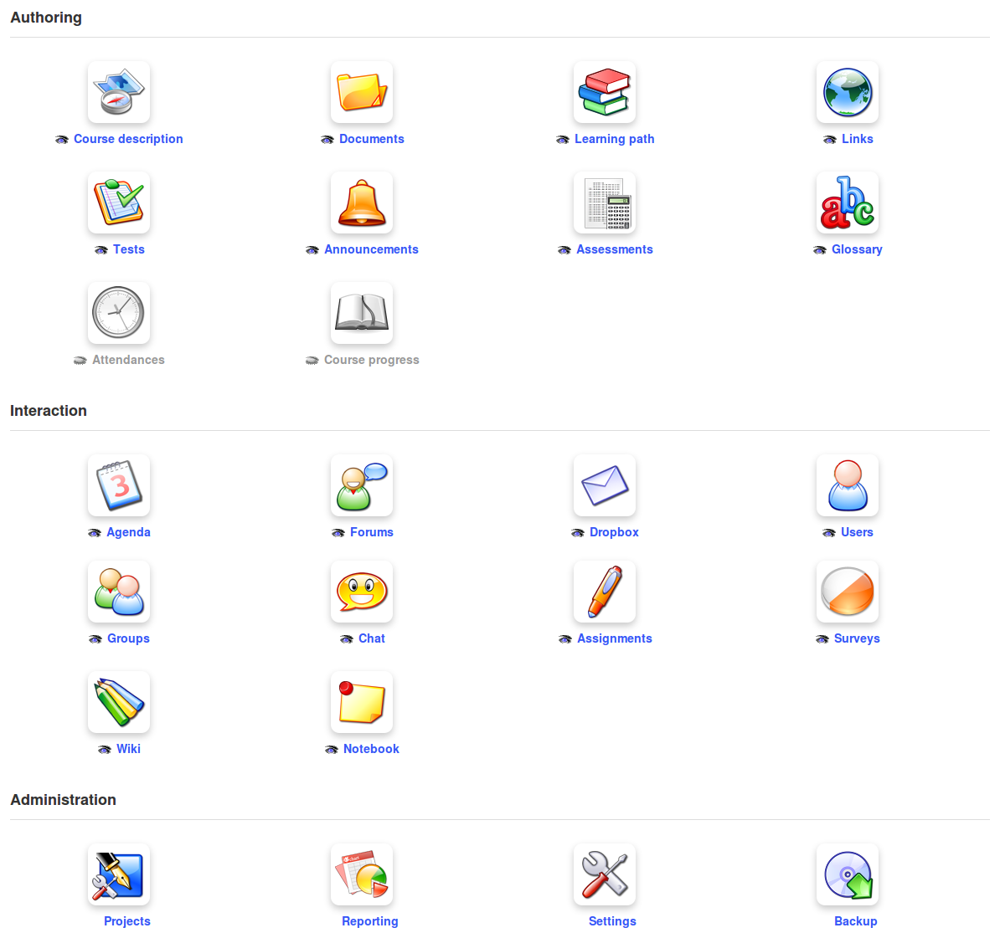

# Administración del curso {#administraci-n-del-curso}

La pestaña _**Mis cursos**_ permite la visualización de los cursos que pueden ser gestionados por el docente (muestran un icono de un lápiz en la parte derecha de la caja del curso para distinguirlos de aquellos en los que el docente está inscrito como alumno, en cuyo caso no tienen el icono de lápiz al lado).

Para acceder a la página principal de tu curso, pulsa sobre el nombre del curso. Aparecerán tres categorías de herramientas:

*   **Creación de contenidos**: permiten la creación de distintos tipos de contenidos en el curso.

*   **Interacción**: permiten la interacción profesor-alumno o alumno-alumno dentro del curso.

*   **Administración**: permite configurar las opciones del curso y realizar algunas tareas de mantenimiento.

*Ilustración 23: Herramientas del curso – vista antigua*

Puedes decidir qué herramientas verán los alumnos y cuales no, pulsando sobre el icono de ojo 

que aparece debajo de cada herramienta. A veces muchas herramientas a la vez pueden intimidar al alumno en su primer acceso.

> **Nota** :según el caso, el administrador puede haber habilitado herramientas disponibles para los docentes del curso o puede permitir herramientas que dependan de extensiones específicas (como la búsqueda de texto completo o la videoconferencia), por lo que tu interfaz de curso puede no ser exacta a la que se muestra en esta captura.

Ilustración 24: Herramientas de creación de contenidos en vista Ipad

> **Nota** : La interfaz del curso se puede mostrar de manera diferente dependiendo de la elección del administrador. Podría, por ejemplo, y desde la versión 1.8.8, permitir una visión más adecuada para dispositivos móviles, como en esta ilustración, la cual se usa por defecto en las versiones 1.9 y posteriores.