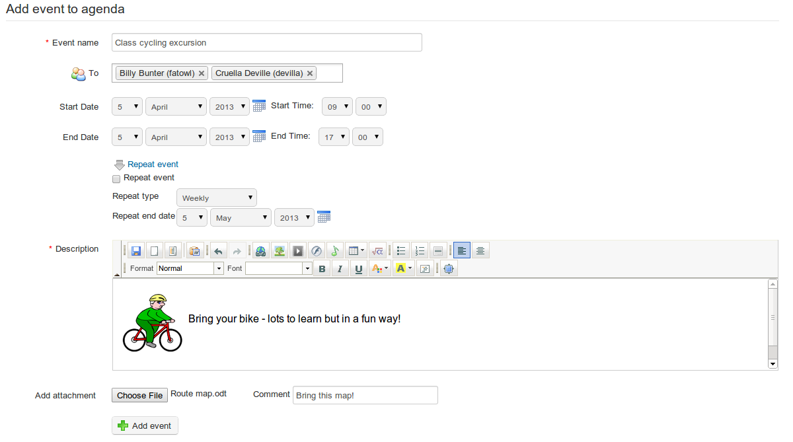

## Adding an event to the course agenda {#adding-an-event-to-the-course-agenda}

Events can be added to the course _Agenda_ in two ways. The simplest and quickest way is simply to click on the relevant date/day/time in the course _Agenda_ (choose week or day view to select a specific time or timescale). You can select users who can see the event, add a title and a brief verbal description, and decide whether to also send the event as an announcement/email:

Illustration 142: Adding an event directly to the calendar

For a more fully configured event entry, however, click the _Add event_ icon  in the tool-bar. This will open a dialogue page allowing entry of a title and the selection of users, but also a richer description (e.g. using graphics), automatic repeat configuration (daily, weekly, monthly, yearly) and the option to add an attachment (to accompany email announcements).

Illustration 143: Adding an event using the Add event tool