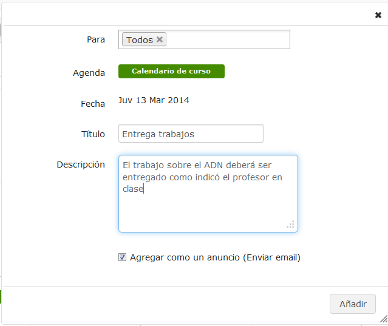
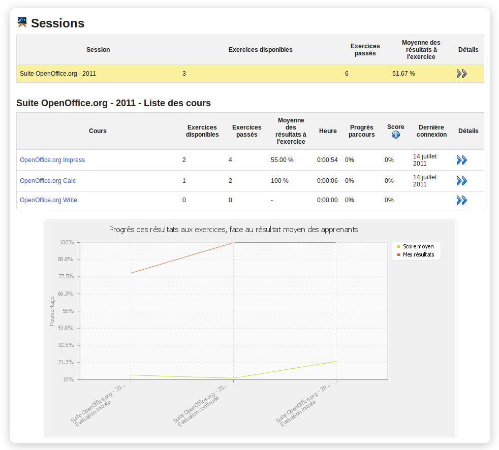

## Añadir un evento al agenda de curso {#a-adir-un-evento-al-agenda-de-curso}

Eventos pueden ser añadidos a la agenda de curso de dos maneras. La manera más sencilla y rápida es simplemente de dar clic en el día correspondiente en la agenda de curso (seleccione la vista semana o diaria para poder seleccionar horas específicas). Puede seleccionar los usuarios que podrán visualizar el evento, añadir un título y una breve descripción verbal, y decidir si quiere enviar el evento también como un anuncio/correo electrónico:

*Ilustración 155: Añadir un evento directamente al calendario*

Para una configuración más completa de tu evento, tendrá que hacer clic en el icono de creación de evento  en la barra de herramientas. Esto abrirá un diálogo permitiendo el ingreso de un título, de una selección de usuarios, pero también de una descripción más enriquecida (p.ej.usando recursos gráficos), repetición automática (diaria-, semanal-, mensual- y anualmente) y la opción de añadir un archivo adjunto (para acompañar los anuncios por correo electrónicos).

*Ilustración 156: Añadir un evento usando el icono Añadir evento*