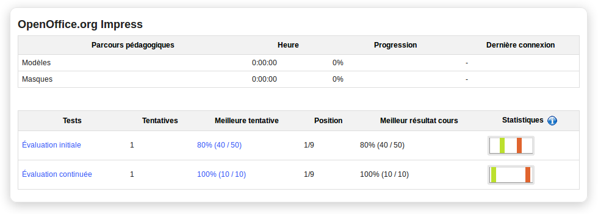

## Importar y exportar eventos {#importar-y-exportar-eventos}

La herramienta agenda de Chamilo soporta la importación y exportación de archivos de calendario estándares (Outlook, iCal). Para importar un archivo Outlook, dale clic en el icono Importación _Outlook_  en la barra de herramientas y sube el archivo relevante como pedido. Luego regresa a la agenda usando el icono agenda .

Los usuarios pueden, además, exportar eventos en el formato iCal desde la ventana emergente que aparece cuando le dan clic en un evento para ver sus detalles. Pueden seleccionar el tipo de privacidad (_confidencial, privado, público_) con el cual el evento estará guardado, y los profesores podrán editar o borrar el evento usando los botones respectivos:

*Ilustración 157: Exportar, editar o borrar un evento*

> **Nota**: Los profesores solo tienen acceso a los botones de edición/borrado a través de la agenda dentro de la página principal del curso – no vía la pestaña Mi agenda donde, como los alumnos, solo pueden ver y exportar los eventos.