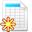

## Crear una hoja de asistencias {#crear-una-hoja-de-asistencias}

Si desea crear una hoja de asistencias adicional, haz clic en _Crear una lista de asistencia_ 

Ilustración 143: Asistencia – Nueva lista de asistencia

Completa los campos de título y descripción y marca la casilla si deseas calificar la asistencia. Si lo haces podrás incluir la asistencia como componente en el apartado de Evaluaciones, asignando un título y una ponderación a la actividad. Por último, haz clic en _Guardar_ y se te indicará añadir una fecha y hora:

Ilustración 144: Asistencia – Paso intermedio para la creación de fechas

Seleccionando _Repetir fecha_ podrás generar rápidamente una serie de fechas y horas para sesiones regulares, por ejemplo, semanalmente a las 22:00 horas. Haz clic en _Guardar_ de nuevo para ver la lista de fechas elegida:

Ilustración 145: Calendario de asistencia

Se pueden editar completamente (por ejemplo si una semana es festiva, eliminarla) y, de la misma forma, puedes añadir nuevas fechas/horas utilizando el icono de _Agregar fecha y hora_ de la barra de herramientas.

Puedes también eliminar la lista completa de fechas/horas utilizando el icono de _Limpiar calendario_. Para ver la hoja de asistencia de la actividad correspondiente haz clic en el icono de _Lista de asistencia_ 

Desde la versión 1.10, se pueden asociar ciertas fechas a grupos específicos de alumnos (definidos en la herramienta de grupos). En este caso, las fechas correspondientes solo aparecerán para los alumnos que forman parte de este grupo.