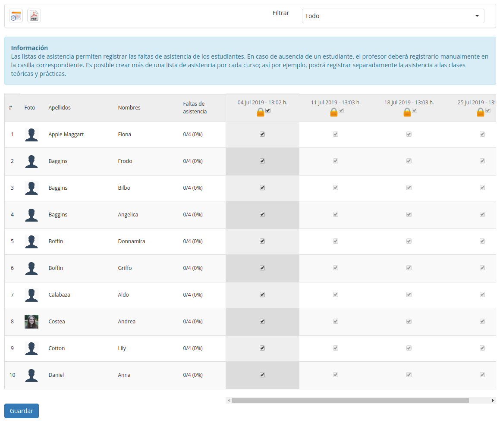

## Registrar asistencias {#registrar-asistencias}

Habiendo configurado las sesiones de tu curso, necesitarás comenzar a registrar la asistencia de tus estudiantes a cada sesión. Puedes hacerlo utilizando la _Lista de asistencia,_ a la que puedes acceder desde la página principal de Asistencia haciendo clic en la lista correspondiente. Verás una relación de los nombres de los estudiantes en la primera columna, a continuación una columna por cada fecha de asistencia. Generalmente, la columna disponible por defecto será la primera que aún no haya sido modificada.

La _**lista de asistencia**_ muestra una tabla con columnas de usuarios, su asistencia y las fechas/horas.

Las fechas que ves dependerán de los datos filtrados en el menú desplegable de la barra de herramientas (elige “todo” y haz clic en _**Filtrar**_ para ver todas las fechas). Para permitir la edición en cada columna, haz clic en el “candado”  en el encabezado de la columna.

*Ilustración 146: Lista de asistencia*

Por defecto, el sistema asume que todos los estudiantes asisten a una sesión, así que **solamente** toma nota de los alumnos que **falten**, **desmarcando** la casilla correspondiente al estudiante para indicar su ausencia.

Un estudiante que haya faltado a más del 10% del total de las sesiones será marcado con un fondo naranja. Un estudiante con más del 25% de faltas aparecerá en rojo. (Estos colores son parámetros fijos que, por ahora, no pueden ser modificados desde la plataforma).

Una lista de asistencia puede ser incluida en la herramienta de evaluaciones como un notable recurso, contando en la evaluación global del curso.